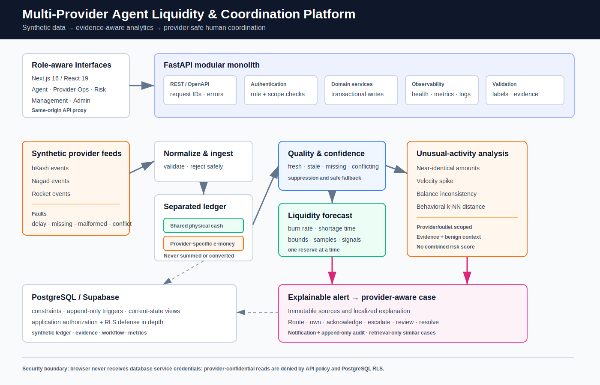
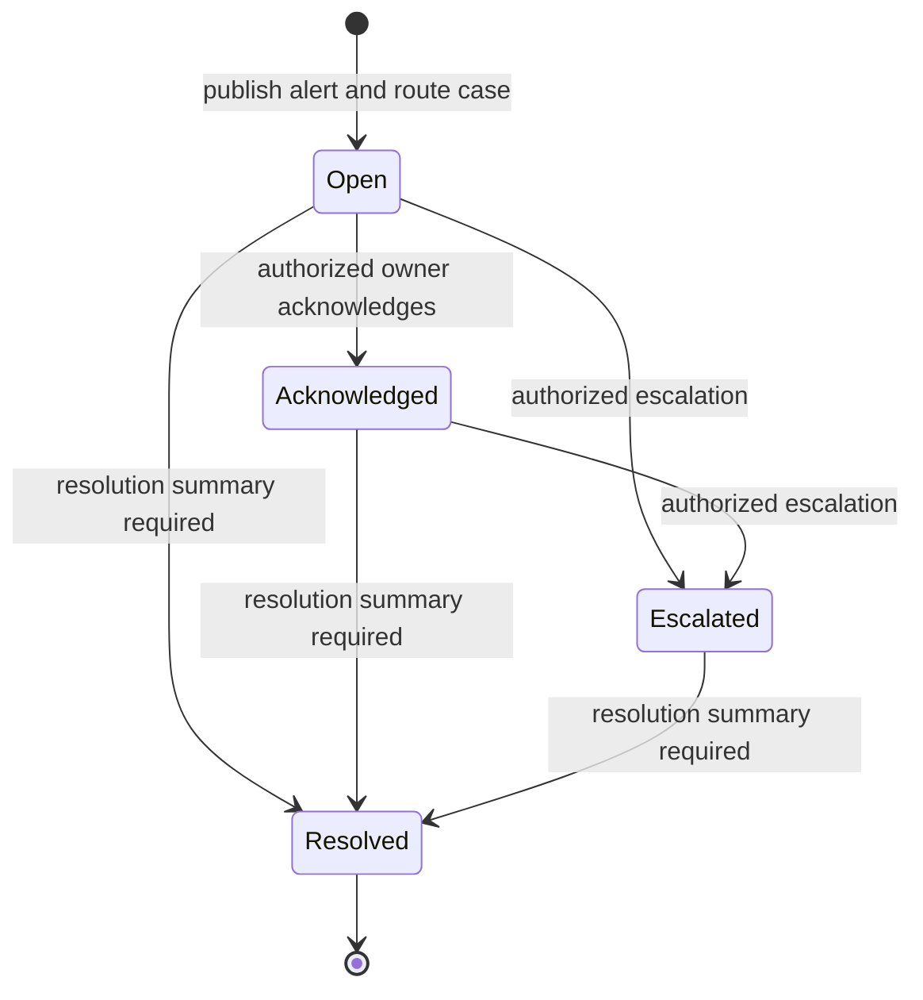
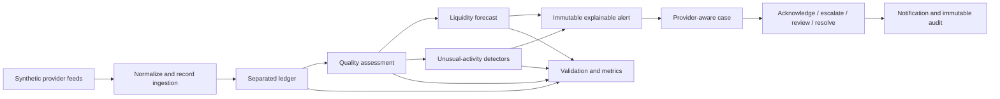

# Architecture

## Goals and constraints

The platform is a decision-support prototype for a multi-provider mobile-financial-service outlet. Its architecture must keep shared physical cash distinct from every provider-specific e-money account, surface uncertainty, preserve evidence, enforce provider boundaries, and support human coordination without executing financial actions.

The implementation is a modular monolith: one Next.js frontend, one FastAPI backend with domain modules, and one PostgreSQL database. This keeps transactions and policy enforcement observable and testable without introducing distributed-system claims the prototype does not demonstrate.

## Component overview

| Component | Implemented responsibility |
|---|---|
| Next.js frontend | Role-aware landing, dashboard, outlets, transactions, liquidity, unusual activity, alerts, cases, notifications, data quality, scenarios, audit, and validation views. |
| FastAPI boundary | Versioned REST routes, request IDs, error envelopes, demo authentication, application authorization, and OpenAPI generation. |
| Ingestion and normalization | Validates synthetic feed events, applies configured faults, records accepted/rejected events, and writes normalized ledger observations. |
| Ledger and read models | Stores append-only transactions and balance snapshots; database views derive latest trusted shared-cash and provider-e-money state. |
| Data quality and confidence | Classifies feeds as fresh, stale, missing, or conflicting and records issue evidence and a confidence modifier. An optional learned calibrator is used only when a valid artifact with sufficient labels is available; otherwise deterministic penalties remain active. |
| Liquidity forecasting | Calculates each reserve independently from recent balance depletion, returning shortage time, confidence bounds, sample count, and explanatory signals. |
| Unusual-activity analysis | Runs active provider/outlet-scoped detectors independently: near-identical amounts, velocity spike, balance inconsistency, and behavioral k-NN distance. |
| Alert and case management | Publishes immutable alerts with typed source links, localized explanations, routing, ownership, notifications, and a mutable optimistic-concurrency case workflow. |
| Similar-case retrieval | Repository-head feature that retrieves provider-scoped resolved cases using deterministic text hashing and cosine similarity; requires migration `011`. It does not generate text or decisions. |
| PostgreSQL / Supabase | Constraints, append-only triggers, current-state views, RLS, evidence history, validation results, and synthetic demo data. |
| Observability and validation | Structured request logs, `/health`, protected `/metrics`, persisted validation results, deterministic dataset validation, database audit, and safety scans. |

## Provider feed ingestion and normalization

The simulator produces provider-labeled transaction and balance events. `app.services.ingestion` validates event type, timestamps, money precision, provider/account relationships, and safe synthetic references. Raw ingestion events remain append-only even when normalization fails. Rejected or malformed events never create ledger rows.

Fault injection supports delay, missing feed, missing field, malformed payload, and conflicting balance behavior. The interactive UI currently exposes delay, missing-feed, and conflicting-balance toggles; the deterministic moderate dataset covers all five fault types.

## Ledger and aggregation

The database stores:

- one `cash_balance_snapshots` history per outlet with no provider identifier;
- one `outlet_provider_accounts` row for each outlet/provider relationship;
- separate `provider_balance_snapshots` histories for those accounts; and
- provider-scoped synthetic transactions.

`v_latest_cash_balance`, `v_latest_provider_balances`, and `v_outlet_dashboard` provide current-state reads without overwriting history. Conflicting provider snapshots coexist; the dashboard view exposes the last trusted value and conflict state rather than silently choosing a candidate. There is no persisted or returned blended monetary total.

## Data quality and confidence

The quality engine records all detected issues, then assigns a top-level status using `missing > conflicting > stale > fresh`. Confidence reflects status, sample adequacy, and rejected-event rate. Missing or sufficiently degraded input makes a forecast non-actionable and suppresses an otherwise detected unusual pattern from alert publication.

The optional calibration path is fail-safe: a learned logistic model is loaded only when its artifact is valid and has at least the configured minimum labeled examples. Cold start continues to use the deterministic formula.

## Liquidity forecasting

The liquidity engine uses an inspectable recent-window burn-rate model. It calculates shared physical cash and each provider-specific e-money reserve separately. A projection includes current balance, burn rate, shortage time when depletion is positive, lower/upper timing bounds, confidence, sample count, actionability, and contributing signals. This is a scenario model, not a production demand forecast.

## Unusual-activity detection

Each active rule creates an independent result; the system does not collapse providers or patterns into a single risk score.

| Detector | Implemented evidence and boundary |
|---|---|
| Near-identical amounts | Cluster count, representative/min/max amount, distinct synthetic parties, and time window. |
| Velocity spike | Current-window count compared with same-hour historical windows; requires a minimum baseline. |
| Balance inconsistency | Conflicting snapshots or a provider balance that diverges from transaction-derived expectation. |
| Behavioral embedding | Five-dimensional provider/outlet transaction vector and nearest historical neighbors; requires sufficient history. |

Every actionable result includes confidence and a plausible benign explanation. Missing/conflicting input produces a suppressed result or an inconclusive cold-start result, not a high-confidence alert.

## Alert and case management

Alerts are immutable analytical records. Publication requires at least one link to a liquidity projection, unusual-activity flag, or quality assessment. Structured explanation templates render and persist English, Bangla, and Banglish snapshots.

Cases are separate mutable workflow records. Routing considers severity, provider, area, and alert type. The service supports assignment, acknowledgement, escalation, notes, review, and resolution with optimistic version checks, idempotency protection, notifications, status history, and audit events.

Notes and human reviews are append-only side records; they do not rewrite immutable alert evidence.

## Authentication and provider-boundary enforcement

Demo mode issues synthetic `demo:<uuid>` bearer tokens for seeded identities. Application authorization checks outlet, area, provider, and role before every confidential operation. PostgreSQL RLS provides defense in depth for authenticated database access.

- Agents receive combined context only for their assigned outlet.
- Provider operations and risk users receive only their provider scope.
- Area managers are restricted by provider and area.
- Management receives aggregate views but is not treated as a provider wildcard for raw confidential data.
- Unauthorized confidential lookups use the same safe `404` response as missing records.
- Admin/service identities are limited to setup and internal controls.

## Notifications, audit, and validation

Case mutations create in-app notifications and append-only audit events in the same workflow. Validation runs, ground-truth labels, and metric results are stored explicitly with dataset split, engine/configuration, sample size, method, and limitations. `/metrics` is protected for management/admin use and combines validation summaries with process counters.

## End-to-end data flow

## Deployment topology

Docker Compose runs PostgreSQL 16, a one-shot migration/seed/bootstrap container, FastAPI, and Next.js. The browser talks to the Next.js origin; Next.js proxies `/api/*` and `/health` to FastAPI. Supabase deployment replaces the local database with a managed PostgreSQL connection; the application remains a single backend deployable.

The configured Supabase audit on 2026-07-12 reported PostgreSQL 17.6, migrations `001–010`, 50 public relations, and 473 columns. Repository head also contains migration `011_case_similar_embeddings.sql`; it was pending on that configured target and must be applied before similar-case retrieval is demonstrated there.

## Security boundaries

1. Browser tokens identify a synthetic demo user; no service-role key is exposed to the browser.
2. FastAPI performs role/scope checks before confidential queries or mutations.
3. PostgreSQL constraints and RLS enforce reserve and provider boundaries.
4. Append-only triggers protect transactions, observations, evidence, explanations, and audits.
5. No component connects to a real provider API or implements movement of funds.

## Important design decisions

- CHECK-constrained domains keep enum evolution transactional.
- Reference seeds are idempotent and separate from immutable migration checksums.
- Alerts and cases have different mutability models.
- Quality degradation changes analytical behavior, not only display styling.
- Similar-case context is retrieval-only and provider-filtered before similarity scoring.
- All AI/ML additions retain deterministic cold-start behavior and human review.

Detailed accepted decisions remain in [`adr/`](adr/) because applied migrations and maintainers reference them.

## Current limitations

- Synthetic data and demo authentication only.
- Burn-rate projection does not model seasonality, causal events, or production demand.
- The moderate validation population primarily evaluates near-identical-amount flags; it does not validate all four detectors equally.
- Confidence calibration depends on a separately trained, sufficiently supported artifact.
- Similar-case retrieval requires migration `011` and a provider-scoped resolved-case corpus.
- No production load, availability, penetration, or regulatory assessment has been completed.
- The browser E2E script requires re-verification against the latest scenario labels and navigation.
