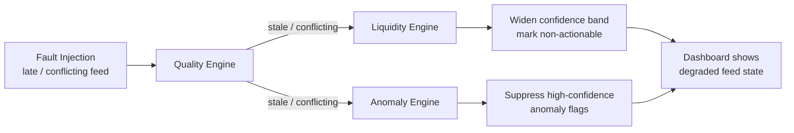
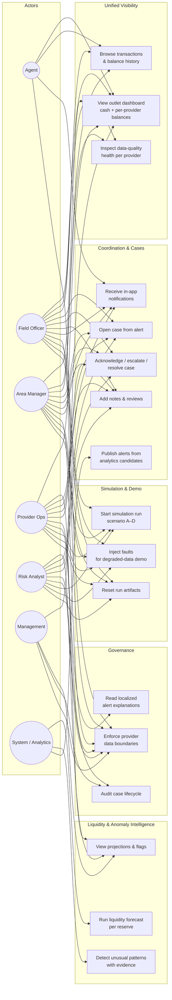
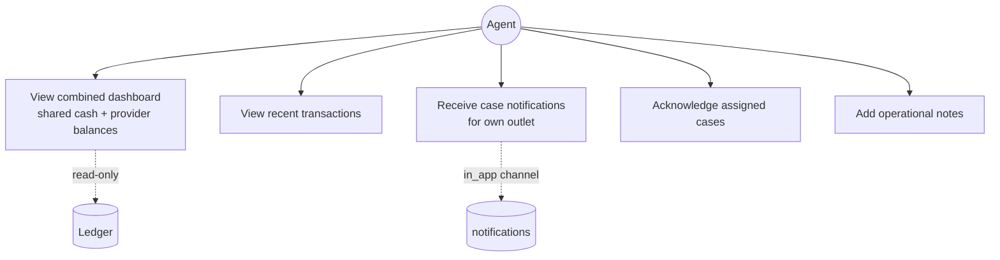
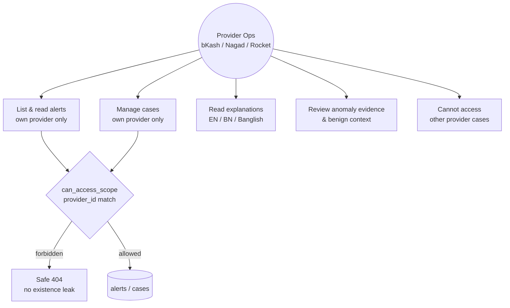
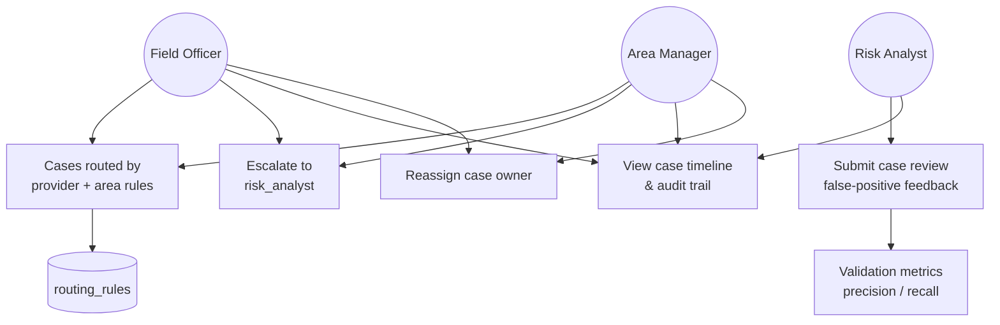
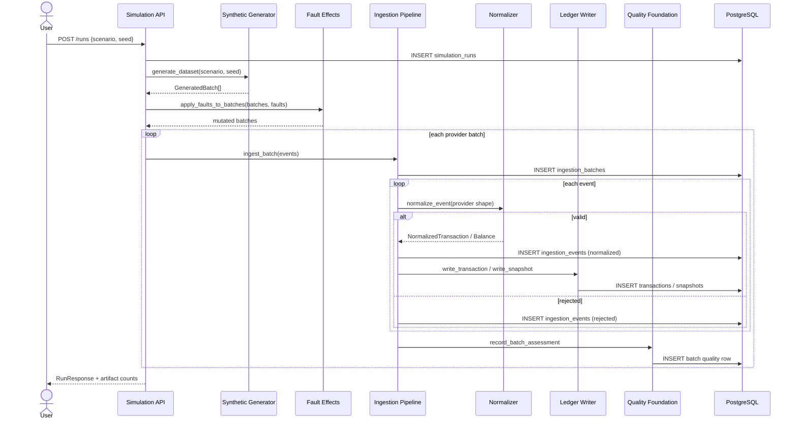
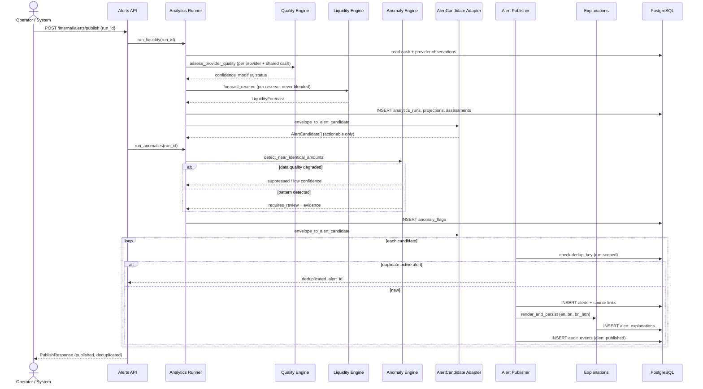
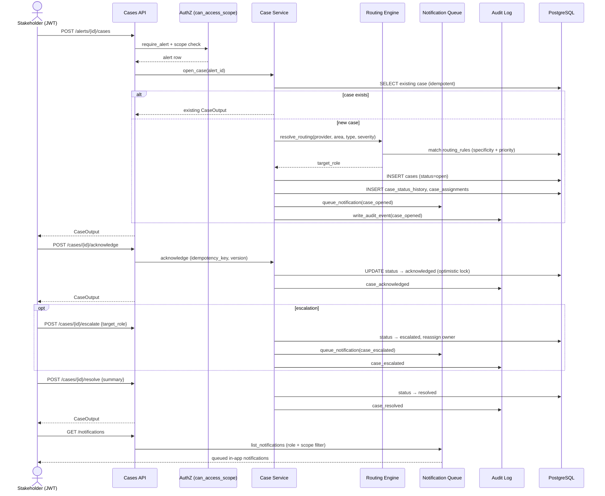
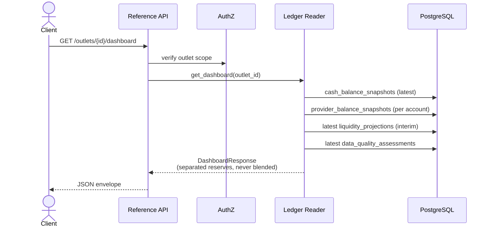
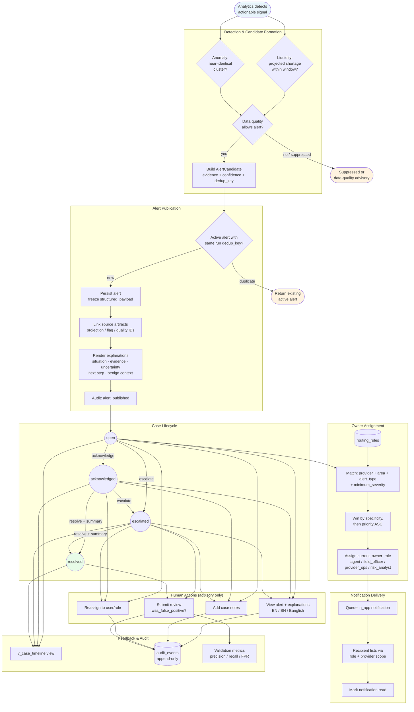

# System Diagrams

Multi-Provider Agent Liquidity & Coordination Platform — diagrams derived from the implemented backend (`backend/app/`), schema (`docs/schema.md`), and system design (`docs/System-Design.md`).

> All diagrams use [Mermaid](https://mermaid.js.org/). Render in GitHub, VS Code (Mermaid preview), or any Mermaid-compatible viewer.

---

## 1. Data-Flow Diagram

End-to-end movement of simulated provider data through ingestion, ledger, analytics, alerts, cases, and audit.

```mermaid
flowchart TB
    subgraph External["Simulated Provider Feeds"]
        BK[bKash Feed]
        NG[Nagad Feed]
        RK[Rocket Feed]
    end

    subgraph Simulation["Simulation Layer"]
        SC[Scenario Generator<br/>scenario_a / b / c / d]
        FI[Fault Injection<br/>late / missing / corrupt]
        SR[(simulation_runs)]
    end

    subgraph Ingestion["Ingestion & Normalization"]
        API_ING[POST /api/v1/batches]
        ADP[Provider Adapters<br/>bkash / nagad / rocket shapes]
        NORM[Normalizer]
        IB[(ingestion_batches)]
        IE[(ingestion_events)]
    end

    subgraph Quality["Data Quality"]
        QF[Batch Assessment<br/>quality_foundation]
        QE[Quality Engine<br/>fresh / stale / missing / conflicting]
        DQA[(data_quality_assessments)]
    end

    subgraph Ledger["Ledger & Aggregation"]
        LW[Ledger Writer]
        TXN[(transactions)]
        CBS[(cash_balance_snapshots)]
        PBS[(provider_balance_snapshots)]
        DASH[GET /outlets/{id}/dashboard]
    end

    subgraph Analytics["Analytics Engines"]
        AR[Analytics Runner]
        LE[Liquidity Engine<br/>per-reserve burn rate]
        AE[Anomaly Engine<br/>near_identical_amounts]
        LP[(liquidity_projections)]
        AF[(anomaly_flags)]
        ENV[ResultEnvelope]
        AC[AlertCandidate Adapter]
    end

    subgraph Coordination["Alert & Case Management"]
        PUB[POST /internal/alerts/publish]
        AL[(alerts)]
        EXP[Explanation Renderer<br/>EN / BN / Banglish]
        AE_TBL[(alert_explanations)]
        RT[Routing Engine]
        CS[(cases)]
        NOTIF[(notifications)]
        AUD[(audit_events)]
    end

    subgraph Clients["Role-Based Clients"]
        UI_AGENT[Agent View]
        UI_OPS[Field Officer / Area Manager]
        UI_PROV[Provider Ops]
        UI_RISK[Risk / Management]
    end

    BK & NG & RK --> SC
    SC --> FI
    FI --> API_ING
    SR --> API_ING
    API_ING --> ADP --> NORM
    NORM --> IB & IE
    NORM -->|accepted events| LW
    NORM -->|rejected| IE
    IB --> QF
    QF --> QE
    LW --> TXN & CBS & PBS
    TXN & CBS & PBS --> DASH

    TXN & CBS & PBS --> AR
    QE --> AR
    AR --> LE & AE
    LE --> LP
    AE --> AF
    LE & AE --> ENV --> AC
    DQA --> ENV

    AC --> PUB
    PUB --> AL
    PUB --> EXP --> AE_TBL
    LP & AF & DQA -.->|typed source links| AL
    PUB --> AUD

    AL -->|open case| RT --> CS
    CS --> NOTIF
    CS --> AUD

    DASH --> UI_AGENT & UI_OPS
    AL --> UI_OPS & UI_PROV & UI_RISK
    CS --> UI_OPS & UI_PROV & UI_RISK
    NOTIF --> UI_OPS & UI_PROV & UI_RISK
```

### Degraded-data branch (Scenario C)



---

## 2. Use-Case Diagrams

### 2.1 Platform overview (all actors)



### 2.2 Agent use cases



### 2.3 Provider Ops use cases (provider-boundary scoped)



### 2.4 Operations & risk use cases



---

## 3. Sequence Diagrams

### 3.1 Simulation run → ingestion → ledger

Triggered by `POST /api/v1/runs` or CLI; executes `run_service._execute_run`.



### 3.2 Analytics run → alert publication

Triggered by `POST /api/v1/internal/alerts/publish` or individual analytics endpoints.



### 3.3 Case lifecycle & notifications (Scenario D)



### 3.4 Dashboard read path



---

## 4. Alert Coordination Flow Diagram

Full path from detection to human resolution, including routing precedence, legal state transitions, and feedback.



### Routing precedence (implementation detail)

Matches `backend/app/services/coordination/routing.py`:

| Step | Rule |
|------|------|
| 1 | Filter active `routing_rules` by `provider_id` (exact or NULL wildcard) |
| 2 | Filter by `area_id` (exact or NULL wildcard) |
| 3 | Filter by `alert_type` (exact or NULL wildcard) |
| 4 | Require alert `severity` ≥ rule `minimum_severity` |
| 5 | Pick highest specificity: provider (+2) + area (+1) |
| 6 | Tie-break: lower `priority` value wins |
| 7 | Fallback: `field_officer` if no rule matches |

### Legal case transitions

Matches `cases.py` and DB trigger in migration 004:

```
open        → acknowledged | escalated
acknowledged → escalated   | resolved
escalated   → resolved
```

Resolution requires prior `acknowledged` or `escalated` status and a `resolution_summary`.

---

## Diagram Index

| # | Diagram | Primary source modules |
|---|---------|------------------------|
| 1 | Data-flow (steady + degraded) | `ingestion/`, `ledger/`, `quality/`, `analytics/`, `coordination/` |
| 2.1–2.4 | Use cases by actor | `api/v1/*`, `core/authz.py`, `contracts/v1/enums.py` |
| 3.1 | Simulation → ledger sequence | `simulation/run_service.py`, `ingestion/pipeline.py` |
| 3.2 | Analytics → alert publish | `analytics/runner.py`, `coordination/alerts.py` |
| 3.3 | Case lifecycle | `coordination/cases.py`, `coordination/notifications.py` |
| 3.4 | Dashboard read | `ledger/reader.py`, `api/v1/reference.py` |
| 4 | Alert coordination flow | `coordination/*`, `alert_candidate_adapter.py` |
