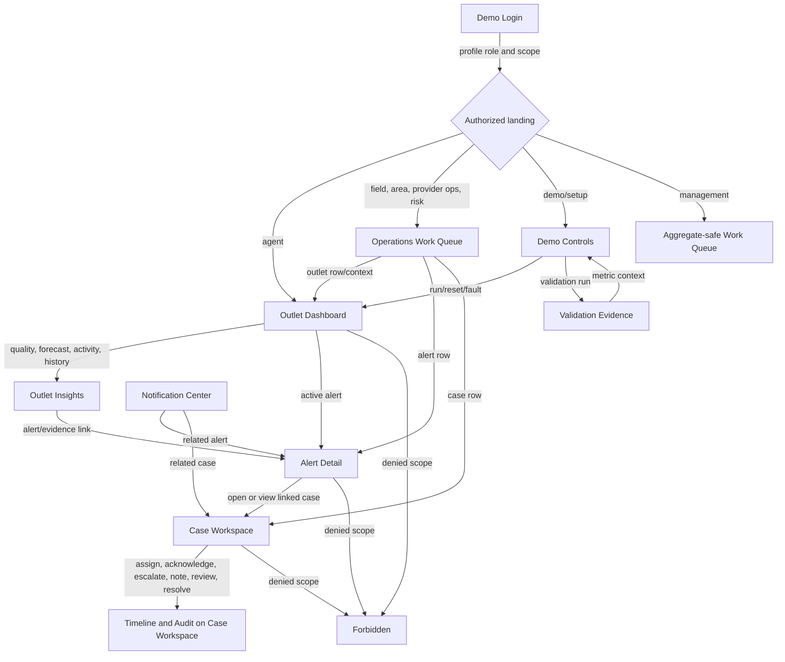

# Frontend Page and Information-Architecture Plan

**Product:** Multi-Provider Agent Liquidity & Coordination Platform  
**Event:** Codex Community Hackathon — bKash presents SUST CSE Carnival 2026  
**Status:** Analysis and planning only  
**Repository baseline reviewed:** 2026-07-11  
**Contract baseline:** `docs/openapi/openapi.v1.json`, API version `1.0.0`

This document defines the frontend product surface and its future API integration. It does not authorize or include frontend or backend implementation.

## Status legend

- **Usable:** registered, persistence-backed behavior exists, and the contract is suitable for an MVP read or action.
- **Partial:** registered and operational, but semantics or data are provisional.
- **Stub:** registered in OpenAPI but returns HTTP 501.
- **Absent:** not registered in the generated OpenAPI or application router.
- **Internal:** registered for server-side analytics orchestration and not suitable for a normal browser client.
- **Recommended API:** proposed here because a required screen cannot be implemented cleanly with the current contract; it is not an existing endpoint.

---

# Section A — Executive Summary

## A.1 Recommended product structure

Use one responsive application shell with role-aware navigation and ten mandatory MVP page surfaces:

1. Demo login.
2. Operations work queue.
3. Outlet dashboard.
4. Outlet insights.
5. Alert detail.
6. Case workspace.
7. Notification center.
8. Demo controls.
9. Validation evidence.
10. Shared forbidden/not-found/error surfaces.

The work queue combines alert and case triage through tabs; the outlet insights page combines liquidity projections, data health, anomalies, transaction history, and balance history through deep-linkable tabs. This avoids one page per endpoint while retaining clear workflows and mobile-friendly information density.

Agents land on their own outlet dashboard. Field officers, area managers, provider operations users, and risk analysts land on the scoped work queue. Management lands on an aggregate-safe work-queue summary and must not receive raw provider evidence by default. Demo/setup users land on Demo Controls. A backend-issued user profile—not a frontend role selector—determines these destinations.

Scenarios A–D form one connected demonstration:

```text
Demo Controls → Outlet Dashboard → Outlet Insights/Alert Detail
              → Case Workspace → Notification/Timeline → Validation Evidence
```

Two pages are recommended after the MVP: an outlet directory and preferences. One combined planning lab is stretch-only for what-if, relationship, and nearby-support concepts. Stretch routes stay out of core navigation until the entire MVP gate passes.

## A.2 Current frontend state

| Concern | Verified state | Planning consequence |
| --- | --- | --- |
| Project | A frontend exists in `frontend/`. | Do not plan from an empty folder. |
| Framework | Next.js 16.2.10 App Router, React 19.2.4, TypeScript. | Use route groups and server/client boundaries supported by the current App Router. |
| Routing | Only `/` exists. | All proposed product routes are new. |
| Existing page | `/` is a server-rendered Phase 2 health shell. It calls `GET /health` and shows ready/degraded/error. | Reuse its health-fetch idea in app diagnostics; do not treat it as a reusable product dashboard. |
| Layout | Root layout with Geist/Geist Mono and default metadata. | Structural shell, navigation, metadata, skip links, and locale support are missing. |
| Components | No product component library or reusable components found. | All shared components in Section D remain to be designed. |
| API layer | `src/lib/api.ts` only contains base-URL resolution and `fetchHealth()` with `no-store`. | A domain API layer, generated types, auth, errors, caching, and mutations are missing. |
| Auth state | None. | Login/session bootstrap and 401 handling are mandatory. |
| Styling | Tailwind CSS 4 with minimal global variables; no product design system. | Define semantic tokens later; this plan intentionally chooses no palette. |
| Status | Health shell is partial; all product pages are missing. | There are no complete product pages to reuse. |
| Verification | `npm run lint` passed. Production build could not fetch Google-hosted Geist fonts in the restricted environment and warned about multiple lockfiles/workspace-root inference. | Use a local/system font fallback or vendor fonts before an offline demo; set an explicit Next workspace root if needed. |

## A.3 Current backend readiness

The actual FastAPI router and generated OpenAPI expose 42 operations. The current readiness split is:

- **Usable:** health; providers, areas, outlets, outlet detail/dashboard, transactions, balance history; simulation scenarios/run/status/reset/fault controls; ingestion batch.
- **Partial:** current and historical data-quality reads. They explicitly identify themselves as foundation estimates derived from ingestion metadata, not the final Phase 4 quality engine.
- **Stub:** liquidity, anomaly, demo-auth/profile/preferences, alert, case, notification, audit, and validation routes. They are discoverable in OpenAPI but return 501.
- **Absent:** `/metrics` and all five stretch operations described in the phase plan.
- **Internal:** the two analytics-run routes. A normal frontend must not invoke them directly.

Authentication currently accepts mock bearer values shaped as `demo:<user-uuid>`. `POST /api/v1/auth/demo-login` and `GET /api/v1/me` are stubs, and route handlers generally depend on authentication without explicit role/scope checks in the handler. Database RLS exists and has recorded verification evidence, but browser-facing provider/area/outlet authorization still needs an end-to-end test at the API boundary.

## A.4 Authority and conflict handling

- `Problem_Statement.md` remains the requirements and safety authority.
- `System-Design.md` remains the workflow/module authority.
- `schema.md` remains the entity/relationship and intended API-contract authority.
- The latest phase plan remains the intended order/MVP authority, but its explicit “empty backend and frontend” assumption conflicts with the repository.
- The implementation and generated OpenAPI remain the truth for current availability.
- `checklist.md` is not a reliable literal status summary: its zero-state framing conflicts with checked migrations, working data routes, and the repository. Treat it as a phase gate list and re-verify every item against code/tests.

---

# Section B — Frontend Page Inventory

| ID | Page | Route | Purpose | Roles | MVP/Stretch | Backend readiness |
| --- | --- | --- | --- | --- | --- | --- |
| F01 | Demo Login | `/login` | Establish a backend-issued demo identity and explain its scope. | All demo identities | Mandatory MVP | **Stub:** login and `/me`; temporary static demo token only |
| F02 | Operations Work Queue | `/work?view=alerts|cases` | One triage surface for scoped alerts and cases. | Field officer, area manager, provider ops, risk analyst; management aggregate read-only; agent assigned-only | Mandatory MVP | **Stub:** alert/case lists; reference filters usable |
| F03 | Outlet Dashboard | `/outlets/[outletId]` | Shared cash, separate provider balances, confidence, shortage timing, active work. | Agent own outlet; scoped operations roles; management aggregate-safe read | Mandatory MVP | **Usable/partial:** dashboard usable; quality provisional; embedded alerts not typed/populated reliably |
| F04 | Outlet Insights | `/outlets/[outletId]/insights?tab=liquidity|quality|activity|history` | Deep investigation without fragmenting the outlet workflow into endpoint-shaped pages. | Scoped agent/operations; risk analyst provider evidence; management summary-only | Mandatory MVP | Ledger usable; quality partial; liquidity/anomaly stubs |
| F05 | Alert Detail | `/alerts/[alertId]?locale=en|bn|bn_latn` | Immutable evidence, localized explanation, uncertainty, benign context, routing, and linked case. | Scoped recipients/reviewers; management sanitized summary only | Mandatory MVP | **Stub** |
| F06 | Case Workspace | `/cases/[caseId]` | Mutable ownership/status/notes/review beside immutable alert evidence and audit. | Assigned/scoped operations and risk roles; agent assigned/own-outlet policy; management read-only summary | Mandatory MVP | **Stub** |
| F07 | Notification Center | `/notifications?status=unread|all` | Review and mark scoped notifications, then deep-link to work. | Authenticated roles | Mandatory MVP | **Stub** |
| F08 | Demo Controls | `/demo` | Select/run/reset Scenarios A–D and inject/recover provider data faults. | Demo/setup/admin only | Mandatory MVP | Simulation APIs usable; downstream analytics/alerts absent/stubbed |
| F09 | Validation Evidence | `/validation?runId=…` | Show at least three measured metrics with method, sample, and limitations. | Demo/setup, management; other roles read-only if approved | Mandatory MVP | Validation stub; `/metrics` absent |
| F10 | System States | `/forbidden`, framework `not-found` and `error` boundaries | Safe access-denied, missing-resource, and recoverable-failure experiences. | All | Mandatory MVP | Standard HTTP support partial; explicit 403 taxonomy missing |
| R01 | Outlet Directory | `/outlets` | Browse only authorized outlets and enter an outlet context. | Field officer, area manager, provider ops, management; risk if required | Recommended after MVP | Outlet list usable; aggregate summaries/filter contract limited |
| R02 | Profile & Preferences | `/settings/preferences` | Show current role/scope and persist locale preference. | Authenticated roles | Recommended after MVP | **Stub** |
| S01 | Planning Lab | `/outlets/[outletId]/planning` | Consolidate what-if, relationship, and nearby-support concepts without financial-action controls. | Authorized operations/demo roles | Stretch | All required APIs absent |

**Counts:** 10 mandatory MVP pages, 2 recommended-after-MVP pages, 1 stretch page; 13 total planned page surfaces.

---

# Section C — Detailed Page Specification

## C.0 Common behavior for all pages

All authenticated routes first require `GET /api/v1/me` to resolve role and server-authorized provider/area/outlet scopes. Until that endpoint exists, a static token may support engineering only; it is not an acceptable final login design.

Common state rules:

- Initial loading uses stable skeleton geometry and retains provider labels.
- Background refresh shows “Updating” without clearing usable last-known data.
- Empty means a successful scoped response with no records; it never implies global absence.
- Stale, missing, malformed, and conflicting data are distinct warnings, with provider and last source time where known.
- Low confidence stays visible beside every projection and anomaly result.
- A suppressed anomaly is a data-quality advisory, never an active risk alert.
- Errors show the safe backend message and request ID. Never render raw exceptions.
- Offline mode may retain clearly time-stamped read data, but disables mutations.
- 401 clears the local session and returns to `/login?returnTo=…`; 403 routes to `/forbidden`; 404 uses not-found; 409/412 opens a concurrency dialog while retaining unsaved text.
- Successful mutations reconcile from the server response and invalidate related queue/detail/timeline/notification queries.
- A repeated idempotent mutation shows the already-committed result, not a duplicate success.

## F01 — Demo Login

**Identity and scope.** Route `/login`. It establishes a demo identity; it is not a free-form production login or a client-trusted role switcher. Primary users are judges and demo operators selecting from server-approved personas. The login response must determine provider, area, outlet, and role scope.

**Main components.** Product/guardrail introduction; server-provided persona cards with role and visible scope; language selector; “Continue as…” action; backend-health indicator; synthetic-data notice; authentication error panel.

**Data requirements.** `GET /health` on load, uncached or 30-second cache; `POST /api/v1/auth/demo-login` with a persona identifier or approved role key; then `GET /api/v1/me`. Required profile fields: user ID, display name, role, locale, provider IDs, area IDs, outlet IDs, permissions. Login/session data is mutable and must not be stored in a shareable URL. Current login/profile routes are stubs.

**Actions.** Continue, change locale, retry health. Login must reject a client-supplied arbitrary scope. On success use a validated same-origin `returnTo`; otherwise role landing. Submission needs double-click protection but not a browser-generated idempotency key unless the backend creates durable sessions.

**States.** Loading personas; backend unavailable; no personas configured; invalid/expired persona; unauthorized; login success. Stale/missing/conflicting financial-data states are not applicable here. Forbidden personas must not be listed.

**Responsive behavior.** Desktop uses a short intro plus persona grid; tablet uses two columns; mobile uses one-column persona cards with role and scope in text and 44px minimum controls.

## F02 — Operations Work Queue

**Identity and scope.** Route `/work`, with `view`, `provider`, `area`, `outlet`, `severity`, `status`, `owner`, and time-range query state. Primary users are field officers, area managers, provider ops, and risk analysts. Agents see assigned/own-outlet work only if policy supports it. Management receives aggregate/sanitized rows, not raw evidence.

**Main components.** Scoped context header; alert/case tabs; counts; filter bar; sort by severity/age/shortage time; alert cards/table; case table; provider/severity/status/confidence badges; data-health warnings; empty/error states; mobile filter drawer. Each alert row shows situation, provider, outlet, confidence, detected time, next step, and case state. Each case row shows case number, provider, owner, status, next step, and last activity.

**Data requirements.** `GET /api/v1/alerts`, `GET /api/v1/cases`, plus providers/areas/outlets for authorized filters. Required list fields are not fully documented: cursor/page metadata, total/unread counts, outlet summary, owner display label, last activity, recipient, and data-health/suppression state. Lists refresh every 15–30 seconds during a demo, on focus, and after relevant mutations; cache per scope/filter for 30 seconds. Records are server mutable; alert evidence itself is immutable.

**Actions.** Filter/sort; open alert; open case; clear filters. Optional quick acknowledge is intentionally omitted from MVP so mutations occur in the case workspace with full context. Deep links preserve `from=/work` and filter query. No destructive actions.

**States.** Standard states plus partial list results, a “suppressed due to data quality” advisory group, low-confidence rows, no assigned work, and per-row provider-safe redaction. An inaccessible deep-linked record goes to forbidden without revealing whether it exists.

**Responsive behavior.** Desktop uses dense tables with a detail preview drawer; tablet collapses low-priority columns; mobile uses cards, sticky alert/case tabs, and a filter sheet.

## F03 — Outlet Dashboard

**Identity and scope.** Route `/outlets/[outletId]`. It is the agent’s primary operational view and the judge-demo center. Agents are locked to their own outlet. Other roles require backend-authorized outlet/provider/area scope. Management sees aggregate-safe summaries only unless raw access is explicitly granted.

**Main components.** Outlet/provider context; shared-cash card; three separate bKash, Nagad, and Rocket balance cards; each card’s observed time, feed health, projection confidence, and shortage time; active alert strip; contributing-signal summary; “View insights” links; last refresh; responsible-language callout. There is never a blended balance total.

**Data requirements.** Primary `GET /api/v1/outlets/{outlet_id}/dashboard`; secondary current quality read only if dashboard health is insufficient. Required fields already include outlet, shared cash, providers, observed times, feed health, projections, alerts, and generated time. `alerts` is currently untyped and likely empty; alert summaries need a stable contract. Refresh 10–15 seconds in the live demo and on scenario completion/focus. Cache by outlet and authorized profile for 15 seconds; preserve last-known data with timestamps. Balance/projection data changes; provider reference data is cacheable longer.

**Actions.** Enter a provider context; open liquidity/quality/activity insight tab; open an alert; manually refresh. The dashboard performs no financial action and no case mutation. Provider selection is a view filter, not a scope escalator.

**States.** Standard states plus: no snapshot; frozen last-known value; one provider degraded while others remain fresh; shared-cash projection unavailable; incomplete provider set; low-confidence forecast; active shortage; combined liquidity/unusual-activity advisory. Malformed/conflicting feeds must not be charted as continuous truth.

**Responsive behavior.** Desktop shows shared cash in its own prominent region and provider cards in a three-column group. Tablet uses two columns. Mobile stacks shared cash first, then labeled provider cards; shortage time and warning remain above the fold.

## F04 — Outlet Insights

**Identity and scope.** Route `/outlets/[outletId]/insights` with `tab=liquidity|quality|activity|history`, `provider`, `reserveType`, and time range. It explains the dashboard without creating four loosely connected pages. Roles inherit the outlet/provider scope of F03; risk analysts default to their provider’s activity tab; management gets summaries only.

**Main components.** Persistent outlet context; tab navigation; liquidity projection cards and confidence intervals; contributing signals; data-quality issue list and health history; anomaly list/evidence preview and suppressed state; transaction table; balance trend chart plus accessible text/table; provider and reserve filters; affected-provider banner; timestamps and limitations.

**Data requirements.** Liquidity: `GET .../liquidity-projections` (stub). Quality: current/history (partial). Activity: `GET .../anomaly-flags` (stub), detail on demand (stub), transactions (usable). History: `GET .../balances/history` with required `reserve_type`, optional `provider_code`, `limit`; transactions accepts optional `provider_code` and `limit`. Current APIs lack cursor/time-range pagination. Refresh current intelligence at 15–30 seconds; history and transactions on filter change/focus. Cache provider/reference data longer, current signals briefly, and immutable transaction rows by ID. Anomaly evidence depends on both flag detail and transaction references.

**Actions.** Change tab/provider/time range; open alert or flag evidence; inspect referenced transactions; copy synthetic IDs; return to dashboard. No “run analytics” control: internal analytics endpoints are server-side only. No money movement or provider-to-provider action.

**States.** Standard states plus insufficient samples, unavailable shortage, widened confidence band, stale/missing/malformed/conflicting feed, suppressed anomaly, benign/dismissed flag, no history for requested interval, and mixed fresh/degraded providers. Charts must offer a tabular/text alternative and gaps rather than interpolated misleading lines.

**Responsive behavior.** Desktop uses tab content with a right evidence panel. Tablet moves evidence below charts. Mobile keeps tabs horizontally scrollable, converts tables to cards or a deliberate horizontal region with labels, and defaults charts to concise text summaries.

## F05 — Alert Detail

**Identity and scope.** Route `/alerts/[alertId]` with `locale`. It presents immutable alert evidence and the localization record. Allowed users are backend-authorized recipients, provider/area/outlet stakeholders, and risk reviewers. Management receives only an explicitly sanitized DTO. Cross-provider existence must not leak through response differences.

**Main components.** Alert identity/type/severity/provider/state; situation; evidence summary and linked projection/anomaly IDs; confidence and uncertainty; plausible benign explanation; safe next step; intended recipient; current case owner/status summary; locale selector; data-health/suppression callout; immutable-evidence label; “Open/View case”; source timestamps.

**Data requirements.** `GET /api/v1/alerts/{alert_id}`, `GET .../explanations?locale=…`, optionally linked `GET /cases/{case_id}`. Alert fields exist for type, provider, outlet, severity, confidence, evidence refs, benign explanation, next step, localized explanation, case, and state. Missing fields: explicit recipient/routing record, source data-health snapshot, explanation revision/template version, and localized benign context. Alert evidence is immutable; case summary is mutable. Cache alert evidence by ID; refetch case summary every 15–30 seconds and on focus.

**Actions.** Switch locale; navigate to evidence tab; open a case once with `POST .../cases`; view existing case. Case creation needs `Idempotency-Key`; if `case_id` exists, navigate instead of creating. Do not allow editing alert evidence.

**States.** Standard states plus superseded/closed alert, explanation unavailable in selected locale with clearly labeled fallback, suppressed anomaly (no “risk” styling), linked case already exists, and repeated case-create returning the same case.

**Responsive behavior.** Desktop uses explanation plus a separate evidence rail. Tablet stacks ownership below evidence. Mobile leads with situation/confidence, then expandable evidence and benign context, with a sticky safe case action.

## F06 — Case Workspace

**Identity and scope.** Route `/cases/[caseId]`. It is the single page for assignment, acknowledgement, escalation, notes, review, resolution, timeline, and audit. Actions depend on current status, permission, assignment, provider, area, and version. Management is read-only and does not automatically see raw evidence/notes.

**Main components.** Case header/status/version; owner and routing; recommended next step; immutable linked-alert evidence panel; legal-action toolbar; assignment control; acknowledgement/escalation/resolution dialogs; required resolution-summary composer; separate notes composer/history; reviewer verdict panel for unusual activity; chronological case timeline; separate immutable audit stream; optimistic-concurrency conflict dialog; notification context.

**Data requirements.** Case detail, linked alert, timeline, audit events; mutation endpoints for assignments, acknowledge, escalate, resolve, notes, review. Current routes are all stubs. Required case fields exist for ID/number/alert/outlet/provider/status/owner role and ID, timestamps, next step, resolution, and version. Missing: owner display name, allowed actions, assignment candidates, routing recipient/history, note DTO, review DTO/verdict enum, timeline/audit schemas and pagination. Refresh detail/timeline every 10–15 seconds during active handling and after mutations; immutable alert/audit items can be cached by ID/event. Draft notes remain local until success.

**Actions.** Assign, acknowledge, escalate, add note, record review, resolve. Every durable mutation uses an `Idempotency-Key`; version-changing mutations send the backend-supported version/`If-Match` value. Escalation and resolution require confirmation; resolution requires a summary; risk verdict never says “fraud confirmed.” Invalid actions are omitted or disabled with an explanation. Success remains on the workspace and focuses the new timeline item.

**States.** Standard states plus assigned elsewhere, illegal transition, stale version, duplicate mutation, resolution validation error, partially loaded timeline, audit unavailable, closed/resolved read-only state, and unsaved note preservation after network/409/412 errors.

**Responsive behavior.** Desktop uses a two-column evidence/workflow layout with timeline below. Tablet stacks actions above history. Mobile uses a compact status header, accordion evidence, full-width dialogs, and sticky legal actions without hiding the current owner/status.

## F07 — Notification Center

**Identity and scope.** Route `/notifications` with `status`, `type`, and cursor. It exposes only notifications addressed to the current user and scope.

**Main components.** Unread/all tabs; notification items with provider, outlet, reason, time, read state, and linked resource; mark-read action; empty/error states. Provider identity remains textual, not color-only.

**Data requirements.** `GET /api/v1/notifications`; `POST /api/v1/notifications/{id}/read`. Both are stubs and lack documented pagination, notification type, related-resource union, and unread count. Poll 20–30 seconds and on focus; cache read items briefly; invalidation follows case/alert actions.

**Actions.** Open linked alert/case; mark one read. Mark-read needs double-click protection and should be idempotent. Destination carries `from=/notifications`; access is rechecked by the destination API.

**States.** Standard states plus no unread items, deleted/inaccessible target, already-read repeat, mixed target types, and partial notification list.

**Responsive behavior.** Desktop uses a compact list; tablet/mobile use full-width items with the target and provider on separate lines and a large read/open target.

## F08 — Demo Controls

**Identity and scope.** Route `/demo`. Only a backend-authorized demo/setup/admin persona may use it. It controls synthetic runs and faults; it is not a business-user page.

**Main components.** Scenario A–D selector with expected story; outlet selector constrained by demo scope; seed/approved overrides; run status and artifact counts; fault panel for delay, missing feed, missing field, conflicting balance, malformed payload; provider selector; run/reset/recover confirmations; “Open dashboard” and generated-artifact links; activity log.

**Data requirements.** Scenario list; create/read/reset run; create/toggle fault. These are usable. Required fields include scenario code/name/config/split; run ID/code/seed/config/status/error/faults/artifact counts; fault type/provider/parameters/enabled/timestamps. Poll active run every 1–2 seconds with backoff, stop at completed/failed/reset; otherwise no background polling. Do not cache active run status; cache scenario catalog. Downstream generated alert/case IDs are missing from `RunResponse`.

**Actions.** Start run, reset, inject fault, disable/recover fault, open the outlet dashboard. Mutations require confirmation for reset and active-fault changes, double-click protection, and preferably `Idempotency-Key` even though the current contract does not document it. The frontend must not call internal analytics-run endpoints; simulation should orchestrate analytics server-side or a safe recommended demo endpoint must do so.

**States.** Standard states plus queued/running/completed/failed/reset, no scenarios, fault scheduled/applied/recovered, downstream processing pending, and run completed without expected alert. Financial data degradation is previewed as the exact warning expected on F03/F04.

**Responsive behavior.** Desktop shows scenario controls beside run state. Tablet stacks them. Mobile uses a linear wizard: choose scenario → run → observe → open dashboard; advanced config is collapsed.

## F09 — Validation Evidence

**Identity and scope.** Route `/validation`, optionally scoped by `runId` and dataset split. It supplies judge-facing evidence, not operational decision controls. Demo/setup and management are primary; other roles are read-only only if authorized.

**Main components.** At least three metric cards spanning analytics/performance/reliability; run metadata; method/sample/limitations disclosure; validation split badge; data-quality incident count; API latency; forecast/anomaly metrics where available; responsible-interpretation note; health status. No score is presented without denominator/method.

**Data requirements.** `GET /api/v1/validation/results` (stub) and planned `GET /metrics` (absent). The validation contract supports run ID/name/split/version/config/status/times and metric code/category/value/unit/sample/method/limitations/details. Refresh running validation every 5 seconds; completed evidence is immutable/cacheable by run ID. Raw Prometheus text, if `/metrics` uses that format, is unsuitable as the only UI contract; prefer validation results for cards.

**Actions.** Select run/split, inspect metric method/limitations, return to demo flow. No recompute action unless a safe authorized API is later added. Deep links retain `runId`.

**States.** Standard states plus running/failed/incomplete validation, fewer than three metrics, zero/invalid sample size, stale metric version, and “not measured” rather than fabricated values.

**Responsive behavior.** Desktop uses a three-card summary and evidence table. Tablet uses two columns. Mobile stacks metrics and keeps method/limitations immediately expandable.

## F10 — System States

**Identity and scope.** `/forbidden`, App Router not-found, and route/global error boundaries. These are product surfaces, not raw framework screens.

**Main components.** Clear status/title; non-sensitive explanation; request ID; retry/back action; safe role landing link; login action for 401; optional health indicator. Forbidden must not name inaccessible providers, outlets, alerts, or cases.

**Data requirements.** Uses normalized errors from all APIs. Existing errors contain `error.code`, `message`, `request_id`, and `details`. A dedicated `ForbiddenError`/consistent 403 code is not evident. Do not cache error responses.

**Actions.** Retry idempotent reads, return to authorized landing, sign in again. Never automatically retry mutations without the same idempotency key.

**States.** 401, 403, 404, 409/412, 422, 429 if introduced, 500, 501 planned capability, offline, and maintenance/degraded health. Stale/missing financial data remains an in-page warning, not a system error.

**Responsive behavior.** Centered, concise, keyboard-focused action on all sizes; no desktop-only diagnostic overflow.

## R01 — Outlet Directory

**Identity and scope.** Route `/outlets`. It improves multi-outlet navigation after the core demo works. Users see only authorized outlets; agent users skip this page. Management receives aggregate-safe summaries.

**Main components.** Scoped filters, outlet list/cards, area/provider badges, data-health summary, shortage priority, active-work count, pagination, and open-dashboard action.

**Data requirements.** Providers, areas, and `GET /outlets`. Current list data is usable but lacks a documented cursor, total, projected shortage, health rollup, and active-work counts. Recommended list-summary fields avoid N+1 dashboard calls. Refresh 30 seconds; cache references longer.

**Actions.** Filter and open outlet. No mutations. Query state is shareable only when the recipient has the same authorization.

**States.** Standard list states plus no outlets in scope, partially degraded summaries, and unavailable priority data.

**Responsive behavior.** Table on desktop, reduced columns on tablet, cards on mobile.

## R02 — Profile & Preferences

**Identity and scope.** Route `/settings/preferences`. It shows the current server-issued role/scope and changes locale only; it cannot change role or provider scope.

**Main components.** Identity summary; provider/area/outlet scope chips; locale choice EN/BN/BN-Latn; save status; sign-out.

**Data requirements.** `GET /me`, `PATCH /me/preferences` (both stubs). Profile must expose display labels and explicit permissions/scopes. Profile cache is session-long but invalidated after preference change or reauthentication.

**Actions.** Save locale with version/idempotency if the profile contract supports it; sign out locally/server-side. No arbitrary scope editing.

**States.** Standard states plus locale fallback, stale profile, server-revoked scope, and successful preference synchronization.

**Responsive behavior.** Narrow readable form at all sizes with native/accessible language names.

## S01 — Planning Lab

**Identity and scope.** Route `/outlets/[outletId]/planning`. This single stretch surface contains what-if, relationship, and nearby-support insights. It must not become a transfer/refill/support-execution interface.

**Main components.** Read-only scenario assumptions, what-if result comparison, synthetic relationship graph/table, nearby-support suggestions, confidence/limitations, and approved-process guidance.

**Data requirements.** Planned what-if create/read, relationship, nearby-support, and support-request endpoints are all absent. Relationships must use synthetic identifiers and provider-safe projections. Results are mutable while running, immutable when completed.

**Actions.** Run a hypothetical analysis and inspect suggestions. Any future support request requires explicit approved-process confirmation and idempotency; no financial action is offered.

**States.** Standard states plus model unavailable, insufficient evidence, provider-redacted relationship, and non-actionable suggestion.

**Responsive behavior.** Desktop can show comparison and graph; tablet/mobile default to a ranked accessible list and textual explanation.

---

# Section D — Shared Component Inventory

| Component | Responsibility and input | Variants | Accessibility | Reused on |
| --- | --- | --- | --- | --- |
| Application shell | Session, role, scope, locale, health, navigation outlet | Agent, operations, risk, management, demo | Skip link, landmarks, focus restoration | All authenticated pages |
| Role-aware navigation | Only valid destinations from backend permissions | Desktop rail, mobile drawer | Current-page announcement; keyboard close | F02–F09, R01–S01 |
| Breadcrumbs | Preserve outlet/alert/case context and `from` route | Compact/mobile | Ordered navigation labels | F04–F06, S01 |
| Context selector | Authorized provider/area/outlet filters; never grants scope | Locked agent, scoped multi-select | Labeled combobox, result count | F02–F04, F08, R01 |
| Provider badge | Provider code and display name | bKash/Nagad/Rocket/unknown | Text/icon in addition to color | F02–F09, R01–S01 |
| Shared-cash card | Balance, timestamp, projection, health | Healthy/degraded/unavailable/shortage | Announces currency and update time | F03, F04 |
| Provider-balance card | One provider e-money balance only | Provider plus health states | Explicit provider text; no color-only identity | F03 |
| Data-health badge | Status, affected provider, last source time, issues | Fresh/stale/missing/malformed/conflicting | Text + icon + details button | F02–F05, F08, R01 |
| Confidence meter | Score/level/modifier and reason | High/medium/low/unavailable | Numeric/text equivalent; no gauge-only meaning | F02–F05, F09, S01 |
| Shortage-time display | Estimated time/window and bounds | Estimated/no shortage/unavailable/past due | Absolute and relative time text | F02–F04, R01 |
| Contributing-signal list | Forecast/anomaly signals with direction/weight/summary | Liquidity/anomaly | Semantic list; abbreviations expanded | F03–F05 |
| Transaction table | Synthetic reference, provider, type/status, amount, times | Compact/evidence/full | Captions, headers, sortable state | F04, F05 |
| Trend chart | Separated balance/quality history; never blends providers | Cash/provider/confidence | Data table/text summary; gaps announced | F04, S01 |
| Alert card | Situation, provider, severity, confidence, next step, state | Liquidity/anomaly/combined/data quality/suppressed | Descriptive link, ordered reading | F02, F03 |
| Severity badge | Advisory urgency | Info/low/medium/high/critical | Text/icon; never color-only | F02, F05–F07 |
| Evidence panel | Immutable sources, IDs, evidence items, source times | Compact/full/redacted | Headings and expandable controls | F04–F06 |
| Benign-context callout | Plausible non-harmful explanation | Present/unavailable/localized fallback | Not visually subordinate to accusation | F04, F05, F06 |
| Safe-next-step panel | Advisory recipient/owner/action/status | Alert/case/read-only | Clear advisory wording | F02, F05, F06 |
| Locale selector | EN/BN/BN-Latn render choice | Page/session | `lang`/`dir`, native labels, focus retained | F01, F05, R02 |
| Case-status badge | Open/acknowledged/escalated/resolved | Active/read-only | Text/icon; status change live region | F02, F05–F07 |
| Assignment control | Authorized owner candidates and current owner | Assign/reassign/read-only | Searchable label; confirmation of result | F06 |
| Case-action toolbar | Only legal, authorized transitions | Acknowledge/escalate/resolve/review | Disabled reason available; logical tab order | F06 |
| Timeline | User-readable case events | Compact/full | Ordered list with actor/time/action | F06 |
| Audit-event item | Immutable technical accountability event | Redacted/full | Structured field labels | F06 |
| Notification item | Reason, target, provider/outlet, time, read state | Read/unread/inaccessible target | Descriptive target and read state | F07, app shell |
| Scenario selector | Scenario story/config/expected outcome | A/B/C/D/normal | Radio semantics and descriptions | F08 |
| Fault-control panel | Inject/recover approved synthetic data fault | Fault type/provider/run state | Confirmation and non-color state | F08 |
| Metrics card | Value/unit/sample/method/limitations | Analytics/performance/reliability | Full text equivalent, not chart-only | F09 |
| Empty state | Scoped absence and next safe step | Queue/history/notifications/metrics | Semantic heading, no misleading global claim | All data pages |
| Error state | Safe error + request ID + retry | Inline/page/offline/501 | Focused alert, copyable request ID | All pages |
| Forbidden state | Non-disclosing access denial | Inline/page | Clear landing action | F10 and deep links |
| Confirmation dialog | Confirm escalation/reset/resolution/sensitive changes | Destructive/sensitive | Focus trap, named buttons, return focus | F06, F08, S01 |
| Concurrency dialog | Compare stale/current version while retaining draft | Note/transition/assignment | Keyboard decision; draft remains available | F06, R02 |

---

# Section E — Page Connection and Navigation Map

## E.1 Route hierarchy

```text
/
├── login
├── work                         ?view&provider&area&outlet&status&owner
├── outlets
│   ├── [outletId]
│   │   ├── (dashboard)
│   │   ├── insights             ?tab&provider&reserveType&from&timeRange
│   │   └── planning             (stretch)
├── alerts
│   └── [alertId]                ?locale&from
├── cases
│   └── [caseId]                 ?from
├── notifications               ?status&cursor
├── demo                         ?runId
├── validation                   ?runId&split
├── settings
│   └── preferences
└── forbidden
```

`/` should become an authenticated redirect: agent → own outlet; operations/risk → work queue; management → aggregate-safe work queue; demo/admin → demo controls; unauthenticated → login.

## E.2 Navigation diagram



## E.3 Connection contract

| Source/trigger | Destination | Parameters/state | Back/deep-link/access behavior |
| --- | --- | --- | --- |
| Login success | Role landing | Server profile; validated `returnTo` | Deep link resumes only after authorization; denial goes to role landing/forbidden. |
| Work-queue outlet link | `/outlets/{outletId}` | `from=/work` plus filters in history state | Back restores queue query/scroll. Deep link supported. |
| Dashboard provider balance or shortage | `/outlets/{outletId}/insights` | `tab=liquidity&provider=code` | Back returns same dashboard/provider context. |
| Dashboard data-health badge | `/outlets/{outletId}/insights` | `tab=quality&provider=code` | Shows affected provider and last timestamp; denial reveals no data. |
| Dashboard/insights alert | `/alerts/{alertId}` | `from`, `locale` | Back returns source tab/filter. Deep link rechecks scope. |
| Alert “Open/View case” | `/cases/{caseId}` | Existing ID or idempotent create result; `from=/alerts/{id}` | Back returns immutable alert. Repeated create uses existing case. |
| Case action | Same case workspace | Version and idempotency key; focus event ID | Browser back does not undo actions; timeline is refreshed. |
| Notification item | Alert or case route | Related resource type/ID; `from=/notifications` | Mark-read may occur before navigation; destination authorizes independently. |
| Demo run/fault completed | `/outlets/{outletId}` | `runId` for traceability | Dashboard refreshes; back returns current run. |
| Demo expected artifact | Alert/case route | Recommended generated artifact IDs | Current run response lacks these IDs; until added, use scoped queue filters. |
| Validation metric | `/validation` or demo run | `runId`, `split`, optionally metric code anchor | Deep links supported; denied users see aggregate-safe forbidden. |

---

# Section F — Role-Based Navigation Matrix

Backend policy is authoritative. “Scoped” always means the intersection of provider, area, outlet, assignment, and explicit permission returned by the server.

| Navigation item/page | Agent | Field officer | Area manager | Provider ops | Risk analyst | Management |
| --- | ---: | ---: | ---: | ---: | ---: | ---: |
| Outlet Dashboard | Full, own outlet | Scoped | Scoped | Scoped provider | Scoped provider, read-only | Aggregate-safe read-only |
| Operations Work Queue | Assigned/own-outlet | Assigned/scoped | Scoped | Scoped provider | Scoped review | Aggregate-safe read-only |
| Outlet Insights: liquidity/quality | Own outlet | Scoped | Scoped | Scoped provider | Scoped provider, read-only | Summary-only |
| Outlet Insights: transactions/anomalies | Own outlet, limited | Scoped | Scoped | Scoped provider | Full within provider | Hidden raw evidence by default |
| Alert Detail | Scoped/assigned | Scoped/assigned | Scoped | Scoped provider | Full within provider | Sanitized read-only |
| Case Workspace | Assigned/limited actions | Assigned/scoped | Scoped | Scoped provider | Review-capable within provider | Read-only summary |
| Notifications | Full personal | Full personal | Full personal | Full personal | Full personal | Full personal summary |
| Demo Controls | Hidden | Hidden | Hidden | Hidden | Hidden | Hidden unless separate demo permission |
| Validation Evidence | Hidden | Read-only if granted | Read-only if granted | Read-only if granted | Read-only if granted | Read-only/full presentation |
| Outlet Directory | Not applicable | Scoped | Scoped | Scoped provider | Scoped/read-only if needed | Aggregate-safe |
| Preferences | Full personal | Full personal | Full personal | Full personal | Full personal | Full personal |
| Planning Lab | Hidden | Stretch/scoped | Stretch/scoped | Stretch/scoped provider | Read-only evidence if granted | Aggregate-safe stretch |

Demo/setup/admin is intentionally outside the requested six-role table: it has Full access to Demo Controls and Validation, and only the explicitly configured synthetic outlet scope. A `management` label alone must never grant demo mutations or raw cross-provider evidence.

---

# Section G — Backend API Mapping

## G.1 Page-to-API matrix

All `/api/v1/*` operations currently require a bearer token. `/health` is public. “Scope” below describes the required product behavior; current API-level enforcement remains a gap.

| Page/state | Method and actual route | Purpose; request → response | Status | Auth/scope | Safety and frontend consumer |
| --- | --- | --- | --- | --- | --- |
| F01 | `GET /health` | No body → service/database readiness | Usable | Public | No cache/short cache; health state only |
| F01 | `POST /api/v1/auth/demo-login` | Approved persona/role key → token/session/profile | Stub | Public-to-session; server chooses scope | Prevent arbitrary scope; login state |
| F01, shell, R02 | `GET /api/v1/me` | Token → user, role, locale, permissions/scopes | Stub | Authenticated self | Session bootstrap/navigation; required fields incomplete |
| R02 | `PATCH /api/v1/me/preferences` | Locale/version → updated profile | Stub | Authenticated self | Idempotency/version desirable; locale state |
| Filters, R01 | `GET /api/v1/providers` | No body → provider summaries | Usable | Auth; only relevant/allowed providers | Long cache; selector/badges |
| Filters, R01 | `GET /api/v1/areas` | No body → areas | Usable | Auth; scoped list required | Long cache; area filter |
| R01 | `GET /api/v1/outlets` | Current query support → outlet summaries | Usable, limited | Auth; provider/area/outlet RLS | Missing cursor/priority summaries; directory |
| F03, R01 | `GET /api/v1/outlets/{outlet_id}` | Outlet ID → outlet details | Usable | Authorized outlet | Detail header; 403/404 non-leakage required |
| F03 | `GET /api/v1/outlets/{outlet_id}/dashboard` | Outlet ID → separated cash/providers, health, projections, alerts | Usable/partial | Authorized outlet/provider | Read cache 15s; `alerts` needs typed contract |
| F04 | `GET /api/v1/outlets/{outlet_id}/transactions` | `provider_code`, `limit` → transaction list | Usable, limited | Authorized outlet/provider | Immutable rows; missing cursor/time filter |
| F04 | `GET /api/v1/outlets/{outlet_id}/balances/history` | Required `reserve_type`; optional `provider_code`, `limit` → snapshots | Usable, limited | Authorized outlet/provider | Never combine reserve types; missing cursor/time filter |
| F03, F04 | `GET /api/v1/outlets/{outlet_id}/data-quality` | Outlet → provider assessments/issues | Partial | Authorized outlet/provider | Foundation estimates only; warnings/confidence |
| F04 | `GET /api/v1/outlets/{outlet_id}/data-quality/history` | Outlet/current query support → assessment history | Partial | Authorized outlet/provider | Cache by filter; missing robust time pagination |
| F03, F04 | `GET /api/v1/outlets/{outlet_id}/liquidity-projections` | Outlet/filter → current/history projection DTOs | Stub | Authorized outlet/provider | Read-only; confidence/shortage/signals |
| F04, F05 | `GET /api/v1/outlets/{outlet_id}/anomaly-flags` | Outlet/filter → flag summaries | Stub | Authorized outlet/provider/risk | Suppression distinct from alert; activity list |
| F04, F05 | `GET /api/v1/anomaly-flags/{flag_id}` | Flag ID → evidence, transactions, benign context | Stub | Authorized provider/risk | Immutable evidence; do not expose cross-provider data |
| F02 | `GET /api/v1/alerts` | Filters/pagination expected → alert summaries | Stub | Recipient/provider/area/outlet scope | Immutable evidence summaries; queue |
| F05 | `GET /api/v1/alerts/{alert_id}` | ID → alert/evidence/explanation/case link | Stub | Authorized recipient/reviewer | Cache immutable portion; alert detail |
| F05 | `GET /api/v1/alerts/{alert_id}/explanations` | Locale expected → localized explanations | Stub | Same as alert | `Accept-Language`/locale; fallback labeled |
| F05 | `POST /api/v1/alerts/{alert_id}/cases` | Alert ID + optional routing data → case | Stub | Authorized case creator | `Idempotency-Key`; one case/alert rule |
| F02 | `GET /api/v1/cases` | Filters/cursor expected → case summaries | Stub | Scoped/assigned | Queue cache and counts |
| F05, F06 | `GET /api/v1/cases/{case_id}` | ID → case/status/owner/version | Stub | Scoped/assigned; management sanitized | Mutable read; case header |
| F06 | `GET /api/v1/cases/{case_id}/timeline` | Cursor expected → readable chronological events | Stub | Scoped case | Append-only list; timeline |
| F06 | `GET /api/v1/cases/{case_id}/audit-events` | Cursor expected → immutable audit events | Stub | More restrictive than case read | Never editable; separate audit panel |
| F06 | `POST /api/v1/cases/{case_id}/assignments` | Owner/role + version → updated case/event | Stub | Authorized coordinator | Idempotency + optimistic concurrency |
| F06 | `POST /api/v1/cases/{case_id}/acknowledge` | Version → updated case/event | Stub | Current/authorized owner | Idempotency + legal transition |
| F06 | `POST /api/v1/cases/{case_id}/escalate` | Reason/target/version → updated case/event | Stub | Authorized current owner/coordinator | Confirm, idempotency, concurrency |
| F06 | `POST /api/v1/cases/{case_id}/resolve` | Required resolution summary/version → resolved case | Stub | Authorized resolver | Confirm, safe language, idempotency, concurrency |
| F06 | `POST /api/v1/cases/{case_id}/notes` | Note/version or case reference → note/event | Stub | Authorized participant | Retain draft; idempotency; note permissions |
| F06 | `POST /api/v1/cases/{case_id}/review` | Advisory verdict/reason/version → review/event | Stub | Risk reviewer policy | Human review; never final fraud label |
| F07, shell | `GET /api/v1/notifications` | Status/cursor expected → personal notifications/count | Stub | Current user only | Poll/cache; notification list/badge |
| F07 | `POST /api/v1/notifications/{notification_id}/read` | Notification ID → updated notification | Stub | Current user only | Idempotent; read state |
| F08 | `GET /api/v1/simulations/scenarios` | No body → scenario catalog | Usable | Demo permission required but not evident | Long cache; scenario selector |
| F08 | `POST /api/v1/simulations/runs` | `scenario_code`, seed, overrides, outlet → run | Usable | Demo/setup + outlet scope required | Prefer idempotency; run state |
| F08 | `GET /api/v1/simulations/runs/{run_id}` | ID → status/config/faults/artifacts | Usable | Run/outlet demo scope | Poll active run; run status |
| F08 | `POST /api/v1/simulations/runs/{run_id}/reset` | ID → reset run | Usable | Demo/setup only | Confirm + idempotency; reset state |
| F08 | `POST /api/v1/simulations/runs/{run_id}/faults` | Type/outlet/provider/parameters/time → fault | Usable | Demo/setup + run scope | Confirm; validate provider requirements |
| F08 | `PATCH /api/v1/simulations/runs/{run_id}/faults/{fault_id}` | `is_enabled` → fault | Usable | Demo/setup + run scope | Idempotent desired; recovery state |
| F09 | `GET /api/v1/validation/results` | Run/split filters expected → validation metric payloads | Stub | Demo/management/read grant | Completed result immutable; metrics page |
| F09 | `GET /metrics` | Intended service/analytics metrics | Absent | Likely restricted or sanitized | Do not parse raw ops metrics as only product DTO |
| F10 | All routes | Error envelope → code/message/request ID/details | Partial | Varies | Normalize 401/403/404/409/412/422/500/501 |
| S01 | What-if/relationship/support endpoints from phase plan | Hypothesis/scope → advisory result | Absent | Explicit scoped permission | Stretch only; no financial actions |

## G.2 Endpoints that normal frontend code must not call

- `POST /api/v1/internal/analytics/liquidity/run`
- `POST /api/v1/internal/analytics/anomalies/run`
- `POST /api/v1/ingestion/batches`

The first two are server orchestration surfaces; ingestion is a simulator/provider adapter concern. If the demo needs to force the pipeline, the simulation run should do it server-side. Do not ship internal service credentials or expose unrestricted ingestion from a browser.

## G.3 Readiness classification summary

| Group | Classification |
| --- | --- |
| Foundation `/health` | Implemented and usable |
| Reference/outlet/ledger reads | Implemented and usable, but list/history pagination is limited |
| Simulation/fault controls | Implemented and usable; authorization/idempotency hardening needed |
| Data quality | Implemented but incomplete/provisional |
| Liquidity/anomaly intelligence | Registered stubs |
| Authentication/profile | Registered stubs; current bearer parser is engineering-only |
| Alerts/cases/notifications/audit | Registered stubs |
| Validation | Registered stub; `/metrics` absent |
| Stretch planning | Planned but absent |

---

# Section H — API Integration Architecture

## H.1 Module boundaries

Organize the future client by domain rather than page:

```text
api/
├── client            base URL, auth, request ID, locale, error normalization
├── generated         OpenAPI-generated DTOs and enums
├── auth              login, me, preferences
├── reference         providers, areas, outlets
├── ledger            dashboard, transactions, balances
├── quality           current/history
├── intelligence      projections, anomaly reads (never internal run routes)
├── coordination      alerts, cases, timeline, audit
├── notifications
├── simulation
└── validation
```

Use the generated OpenAPI for request/response types after regenerating it from the same backend commit. Keep small view models for presentation only; do not re-declare provider, case-status, locale, severity, confidence, fault, or role enums manually.

## H.2 Session and request behavior

- Prefer an HTTP-only same-site demo session cookie. If bearer tokens remain necessary, keep them in memory and avoid localStorage; never place them in URLs or logs.
- Bootstrap with `/me`; route guards use profile permissions for navigation convenience, while every API remains server-authorized.
- Generate a client request ID per attempt and send it in the backend-supported header; display the server request ID from error envelopes.
- Send `Accept-Language` (`en`, `bn`, or `bn-Latn` mapping to the backend locale enum) and keep a page `locale` query only where shareable localized alert deep links are useful.
- Normalize errors into `{status, code, safeMessage, requestId, fieldErrors, retryable, conflictVersion}`. Preserve 501 as “planned capability unavailable,” not a generic crash.

## H.3 Query and cache model

Suggested query-key shapes:

```text
['me']
['outlets', authorizedScopeHash, filters]
['dashboard', outletId]
['quality', outletId, provider, timeRange]
['projections', outletId, provider]
['anomalies', outletId, provider, filters]
['alerts', scopeHash, filters]
['alert', alertId, locale]
['cases', scopeHash, filters]
['case', caseId]
['caseTimeline', caseId, cursor]
['caseAudit', caseId, cursor]
['notifications', status, cursor]
['simulationRun', runId]
['validation', runId, split]
```

- Reference data: 5–30 minute stale time.
- Dashboard/current intelligence: 10–30 seconds during demo, focus refresh, exponential backoff on failure.
- Active simulation: 1–2 second polling, stopped when terminal.
- Active case: 10–15 second polling or a future event channel; do not require WebSockets for MVP.
- Immutable transactions, alert evidence, completed validation, and audit events: cache by ID/cursor; append/invalidate when new events arrive.
- Never reuse a cache entry across different scope/profile hashes. Clear all scoped caches on identity change.

## H.4 Mutations and concurrency

- Create one UUID `Idempotency-Key` per user intent and reuse it on transport retries. Use it for case creation, assignment, acknowledgement, escalation, resolution, note, review, simulation start/reset/fault, and notification read where supported.
- Send the case `version` in the documented body or `If-Match` header. The backend must choose and document one consistent approach.
- Optimistically update only reversible display state such as notification read. Case transitions should show pending state, then reconcile from the authoritative response.
- On 409/412, refetch the current case, retain note/resolution drafts, and present a conflict dialog. Never silently overwrite.
- Invalidate dashboard/alerts/cases/timeline/notifications after a coordination mutation and simulation-generated event.

## H.5 Filters, pagination, and URL state

- Provider/area/outlet filters are server queries and must be intersected with the authenticated scope.
- Keep shareable list/tab filters in `URLSearchParams`; keep secrets, tokens, drafts, and unauthorized IDs out of URLs.
- Standardize cursor responses as `{items, next_cursor, has_more}` and request `cursor`, `limit`, `from`, `to`, `provider_code`, `area_id`, `outlet_id`, `status`, and `owner` only where supported.
- Avoid N+1 calls: the backend should return queue and outlet-list summaries suitable for their rows.

---

# Section I — UX Rules

## I.1 Provider separation

- Shared physical cash has its own card, label, reserve type, and chart series.
- bKash, Nagad, and Rocket e-money each have independent cards and filters. Never show an “all provider balance” sum.
- Repeat provider identity as text/icon in cards, rows, alerts, cases, evidence, and timeline. Color is supplementary.
- A provider filter changes the view, not authorization. Cross-provider confidential data must be rejected by the API and excluded from cached state.

## I.2 Data quality and confidence

- Every projection shows score/level, estimated shortage time or “unavailable,” and the source observation time.
- Fresh, stale, missing, malformed, and conflicting are separate states. Identify the affected provider and last source time.
- Degraded data uses gaps, frozen-last-known labels, or unavailable values—not smooth inferred charts.
- A suppressed anomaly is labeled “Evaluation suppressed due to data quality”; it is not placed among confirmed active alerts.
- Low confidence remains visible even when severity is high. Severity and confidence answer different questions.

## I.3 Explainability and safe language

Every high-impact alert presents situation, evidence, confidence, uncertainty, plausible benign explanation, safe next step, recipient, owner, and current status. If the contract lacks one field, show “Not assigned/Not available,” never invent it.

Preferred phrases include “Unusual activity,” “Requires review,” “Possible liquidity pressure,” “Estimated,” “Potential inconsistency,” and “Human review recommended.” Prohibited product copy includes “Fraud confirmed,” “Fraudster,” “Criminal activity,” “Block account,” “Freeze funds,” “Transfer funds,” “Refill wallet,” and “Reverse transaction.”

## I.4 Workflow clarity

- Alert evidence is immutable and visually separated from mutable case ownership, status, notes, and reviews.
- The case state machine controls available actions. Frontend hiding is ergonomic only; backend authorization and transition validation are mandatory.
- Escalation and resolution require confirmation; resolution requires a summary.
- Conflict handling retains unsaved text and identifies that the case changed elsewhere.
- Editable notes and immutable audit history never share the same composer/list without clear labels.
- The platform gives safe recommended next steps, not financial-action controls.

## I.5 Accessibility and localization

- All interactions are keyboard accessible with visible focus and semantic headings/landmarks.
- Status uses text/icon in addition to color and meets contrast requirements.
- Charts provide text summaries and accessible tables.
- Apply `lang="bn"` to Bangla content, verify Bengali glyph shaping, and avoid font dependencies that fail offline.
- Announce mutation/status updates through a polite live region; move focus into dialogs/errors appropriately.
- Use at least 44×44px touch targets for agent-facing mobile controls.

---

# Section J — Scenario-to-Page Mapping

| Scenario | Start/role | Pages and components | APIs | Expected visible state and outcome |
| --- | --- | --- | --- | --- |
| A — Hidden liquidity shortage | F08 Demo Controls; demo/setup, then agent | F08 scenario selector/run → F03 separated balances/shortage → F04 liquidity tab → F05 alert | Scenario/run/status; dashboard; projections; alert detail/explanation | bKash shortage time and confidence are visible without blending balances; alert states “Possible liquidity pressure” and links to routed case. Final: F05 or F06. |
| B — Pressure plus unusual activity | F03; provider ops or risk analyst | F03 alert strip → F04 activity/evidence → F05 benign context/localized explanation → F06 case | Dashboard; anomaly list/detail; alert/explanations; case | Velocity/repeated-amount evidence, confidence, uncertainty, and a plausible benign Eid-demand explanation. No fraud claim. Final: open/acknowledged case. |
| C — Missing/stale/malformed/conflicting data | F08; demo/setup, then agent/provider ops | F08 fault panel → F03 degraded provider card → F04 quality tab and suppressed anomaly state | Fault create/toggle; run status; dashboard; quality current/history; anomaly list | Only affected provider degrades; last source time and low confidence show; misleading forecast/anomaly is unavailable or suppressed. Final: F04, then recovery refresh. |
| D — Coordinated response and closure | F02; provider ops/field/area/risk | F02 case queue → F06 assign/acknowledge/escalate/note/review/resolve → F07 notification → F06 timeline/audit → F09 metrics | Case list/detail/actions/timeline/audit; notifications/read; validation results | Recipient, owner, next step, state transitions, resolution summary, immutable history, and notification are visible. Final: resolved F06 and validation evidence. |

For a short judge demo, run A and B together, inject C while viewing the same outlet, then complete D on the linked case. This avoids navigation resets and demonstrates the entire connected product rather than isolated features.

---

# Section K — MVP vs Stretch Classification

## K.1 Mandatory MVP

- Pages F01–F10.
- Application shell, role-aware navigation, context selector, provider/shared-cash cards.
- Data-health/confidence/shortage/contributing-signal components.
- Alert/evidence/benign-context/safe-next-step/localization components.
- Case assignment, acknowledgement, escalation, note, review, resolution, timeline, audit, conflict handling.
- Notifications, scenario/fault control, and at least three transparent validation metrics.
- Loading, empty, partial, stale, missing, conflicting, error, offline, unauthorized, forbidden, not-found, conflict, success, and repeat-idempotent states.
- Responsive desktop judge flow and mobile agent flow, including keyboard/a11y basics and Bangla rendering.

## K.2 Recommended after MVP

- R01 Outlet Directory.
- R02 Profile & Preferences.
- Queue preview drawer, richer history filters, persistent personal locale, and sanitized management summary improvements.

## K.3 Stretch

- S01 Planning Lab.
- What-if comparison, synthetic relationship graph, nearby-support suggestions, and an approved-process support request.
- Additional anomaly patterns, real-time push, and advanced chart interactions.

Stretch pages do not appear in core navigation until all F01–F10 exit conditions pass. The MVP must not sacrifice provider separation, evidence, data-degradation safety, RBAC, or case lifecycle for planning-lab breadth.

---

# Section L — Recommended Implementation Order

| Step | Pages/components | Required APIs | Mock/fixture need | Exit condition | Depends on |
| --- | --- | --- | --- | --- | --- |
| 1 | F01, F10, shell, role nav, error normalization | Health, demo login, me | Server-approved personas/profile/error fixtures until stubs are implemented | Each role reaches only its correct landing; 401/403/404 safe | Backend auth decision |
| 2 | F03, provider/shared-cash cards, provider context | Dashboard, outlet detail/providers | Scenario A dashboard fixture if projection fields are empty | Cash plus three separate providers render with timestamps on desktop/mobile | Step 1 |
| 3 | F04 quality/liquidity/history tabs, confidence and charts | Quality current/history, projections, transactions, balances | Final quality/projection fixtures; current quality API is provisional | Fresh/degraded/unavailable states and shortage timing are explainable | Step 2; intelligence contracts |
| 4 | F02 alert tab, F05, anomaly evidence and localization | Alert list/detail/explanations; anomaly list/detail | Scenario B/C immutable evidence and locale fixtures | Evidence, benign context, safe language, suppression, locale toggle work | Steps 1–3 |
| 5 | F02 case tab, F06 workflow and concurrency | Case list/detail/actions/timeline/audit | Full case state-machine fixtures including 409/412 | A routed case completes assignment → acknowledgement → escalation/note/review → resolution | Step 4; auth/action policy |
| 6 | F07 and shell unread indicator | Notification list/read | Notification target fixtures | Notification deep-links safely and read is idempotent | Step 5 |
| 7 | F08 scenario/fault controls | Existing simulation APIs plus downstream artifact linkage | Expected artifact mapping until response adds IDs | A–C can run/reset/fault/recover and open the affected outlet/alert | Steps 2–6 |
| 8 | F09 metrics | Validation results; `/metrics` or sanitized summary | Three honest metric fixtures with method/sample/limitations | At least three numeric measures are traceable to a run | Step 7 |
| 9 | Cross-page responsive/a11y/offline hardening | Stable release API | State matrix fixtures and role/provider test personas | Keyboard, screen reader summaries, Bangla, mobile, forbidden, offline, and no cross-scope cache leakage pass | Steps 1–8 |
| 10 | R01/R02, then S01 only after freeze | List summaries/preferences; stretch APIs | Optional | Recommended pages pass without altering core demo; stretch remains isolated | Complete MVP |

Mocks must use the same generated DTO shapes as the planned API. They should be replaced endpoint-by-endpoint and must never hide a 501 as if a backend feature were complete.

---

# Section M — Gaps, Conflicts, and Decisions Needed

| Severity | Affected page(s) | Current evidence | Recommended resolution | Blocks |
| --- | --- | --- | --- | --- |
| Critical | F01, all protected pages | Demo login and `/me` are 501; current mock bearer requires a known UUID. | Implement server-approved demo personas, session/token issuance, profile permissions and explicit scopes. | Design can proceed; implementation/demo blocks |
| Critical | F02, F05–F07 | All alert/case/notification/audit endpoints are registered stubs. | Implement Phase 5 contracts and state machine before integrating these pages. | Implementation blocks |
| Critical | F03–F05 | Liquidity/anomaly routes are stubs; dashboard alerts are `list[Any]`. | Implement typed intelligence/alert summaries and connect simulation → engines → alerts. | Implementation blocks; exact row design partially blocks |
| Critical | All scoped pages | Most handlers authenticate but do not visibly enforce role/provider/area/outlet policy; RLS evidence is database-level. | Add/test API-layer authorization plus RLS request-context propagation for two-provider denial cases. Standardize non-leaking 403/404. | Security implementation blocks |
| High | F06 | Mutation request/response bodies, `Idempotency-Key`, version/`If-Match`, allowed actions, notes/review/timeline schemas are not documented in usable OpenAPI. | Freeze concrete contracts, legal-transition errors, idempotent replay behavior, and conflict payloads. | Interaction detail and implementation |
| High | F08 | Simulation run output gives artifact counts but not generated projection/alert/case IDs; analytics triggers are internal stubs. | Make simulation orchestrate downstream processing and return/link generated artifact IDs or add a safe demo-run summary endpoint. | Reliable demo navigation |
| High | F09 | Validation results is 501 and `/metrics` is absent. | Implement validation result reads; decide whether `/metrics` is Prometheus-only or expose a sanitized product summary. | MVP validation implementation |
| High | F03–F04 | Data-quality APIs say `phase: foundation` and derive interim estimates from ingestion metadata. | Replace with persisted Phase 4 assessments and document stale/missing/malformed/conflicting semantics. | Accurate state implementation |
| High | F02, R01, F07 | List contracts lack cursor/page metadata, totals/counts, and frontend-ready summaries. | Adopt consistent cursor pagination and list DTOs; include last activity, owner label, health/priority, unread count as appropriate. | Scale/performance; not basic visual design |
| High | F05 | Alert contract lacks explicit recipient/routing record, source quality snapshot, template/version, and localized benign context. | Extend alert detail or add stable nested routing/explanation DTOs. | Required explainability content |
| High | F06 | Case exposes owner IDs/role but not display label/candidates/permissions; management redaction contract is undefined. | Return `allowed_actions`, display-safe owner, assignment candidates endpoint/field, and sanitized role-specific DTOs. | Final case control design |
| Medium | F04 | Transactions/balance history only support `limit` and provider (plus reserve type); no cursor/from/to. | Add cursor and time-range filters with deterministic sort. | Large-data usability, not basic MVP demo |
| Medium | F07 | Notification target union, unread count, pagination, and repeat-read semantics are undocumented. | Define typed related resource and idempotent read response. | Notification integration detail |
| Medium | F10 | Error taxonomy defines unauthorized but no clear forbidden/conflict/rate-limit classes in inspected source. | Standardize 403, 404 non-leakage, 409/412 concurrency, 429, and 501 payloads with request IDs. | Error implementation |
| Medium | All | Latest phase plan says treat both folders as empty; repository contains six migrations, seeds, working data/simulation APIs, and a Next health shell. Checklist mixes zero-state wording with checked implementation evidence. | Keep phase plan as dependency order, but establish a verified implementation-status appendix/checklist before scheduling work. | Planning accuracy, not visual design |
| Medium | Verification | Historical report records 53 schema tests passing, but current `pytest` cannot collect because `psycopg2` is missing. | Restore the documented test environment and rerun API/schema authorization tests. | Release confidence |
| Medium | Frontend build | Production build attempted external Google font fetch and failed in restricted network; multiple lockfiles caused a root warning. | Use local/system fonts for offline judging and set explicit workspace root/remove ambiguity intentionally. | Offline demo build |
| Low | R02 | Locale preference endpoint is stub; locale ownership between URL/profile/header is not decided. | Page URL overrides alert rendering, profile provides default, `Accept-Language` carries request preference. | Preference implementation only |
| Low | S01 | All stretch APIs are absent. | Keep Planning Lab out of navigation and design backlog until MVP freeze. | Stretch only |

## Decisions required before visual design begins

1. Freeze the demo persona list and exact role/provider/area/outlet permissions, including whether agents may acknowledge or note cases.
2. Decide the management DTO/redaction policy; “management” must not mean raw cross-provider access.
3. Freeze alert-list, case-list, case-action, notification, timeline, and audit schemas.
4. Choose the optimistic-concurrency contract (`If-Match` recommended) and idempotency header/replay semantics.
5. Decide whether `/work` is the provider/risk landing for all non-agent roles and whether management receives a separate aggregate response.
6. Make the simulation run reliably identify its generated alert/case/validation artifacts.
7. Define the final data-quality thresholds and how malformed/conflicting inputs affect forecasts and anomaly suppression.

---

# Repository Evidence Reviewed

The plan was derived from the following source groups:

- Requirements/design: `docs/Problem_Statement.md`, `docs/System-Design.md`, `docs/schema.md`, `docs/16-hour-hackathon-phase-distribution.md`, `docs/checklist.md`, `docs/Prototype-Simulation-Walkthrough.md`.
- Project guidance/readmes: root `README.md`, `backend/README.md`, `frontend/README.md`, frontend `AGENTS.md`.
- API truth: `backend/app/main.py`, API router/health/reference/simulation/ingestion/stub route files, auth/errors/middleware/request context, generated `docs/openapi/openapi.v1.json`.
- Contracts/services: all current `backend/app/contracts/v1/*` contracts and relevant ledger, quality, ingestion, simulation, synthetic-data, and adapter services.
- Data/security: migrations `001`–`006`, seeds, read views, RLS/grants/triggers, ADRs, verification reports and schema tests.
- Frontend: `frontend/src/app/layout.tsx`, `page.tsx`, `globals.css`, `frontend/src/lib/api.ts`, package/TypeScript/Next/ESLint configuration.
- Verification: current frontend lint, attempted production build, current backend test collection, and recorded verification artifacts.

