# Project Data and API Schema

## 1. Purpose

This document defines the implementation-ready data model and proposed REST API contract for the Multi-Provider Agent Liquidity & Coordination Platform. It is derived from the problem statement, system design, implementation checklist, and 16-hour delivery plan.

The schema is designed for PostgreSQL on Supabase and a single modular-monolith backend. It supports the committed MVP while leaving narrow extension points for the recommended and optional features. This is a design artifact only; it does not contain migrations or application code.

## 2. Core design decisions

1. **An outlet owns one shared physical-cash pool.** Cash is stored separately from provider e-money and is never added to a provider balance in persisted data.
2. **Each outlet-provider relationship has a separate e-money account.** There is no transfer, conversion, settlement, refill, recovery, reversal, freeze, or blocking entity or endpoint.
3. **Source observations are append-only.** Transactions, balance snapshots, ingestion events, analytical results, rendered alert explanations, and audit events are historical evidence rather than mutable current-state rows.
4. **Current values are database views.** Latest cash balance, provider balance, feed health, and dashboard summaries are derived without discarding history.
5. **Alerts and cases are separate.** An alert is immutable analytical/advisory output. A case is the provider-aware human workflow opened for an important alert.
6. **Data quality affects analytics explicitly.** Every projection and anomaly evaluation identifies the quality assessment used. Degraded input lowers forecast confidence and suppresses high-confidence anomaly alerts.
7. **Provider scope is denormalized onto confidential workflow rows.** This makes application authorization and Supabase Row Level Security straightforward and auditable.
8. **Explanations are structured and versioned.** English, Bangla, and Banglish are rendered from one alert payload and saved as snapshots so later template changes do not rewrite history.
9. **All domain data is synthetic or mock.** Synthetic subject references are opaque and cannot contain a real phone number, account number, name, PIN, OTP, password, credential, or private key.
10. **Analytics are reproducible.** Simulation seed, engine version, configuration, input window, ground truth, and metric method are persisted.

## 3. Naming and type conventions

| Concern | Convention |
|---|---|
| Primary keys | UUID named `<entity>_id`, generated with `gen_random_uuid()` |
| Time | `timestamptz` in UTC; API uses ISO 8601 |
| Money | `numeric(18,2)`, non-negative unless explicitly representing a signed delta |
| Currency | ISO code; MVP allows only `BDT` |
| Scores | `numeric(5,4)` constrained to `0 <= value <= 1` |
| Structured details | `jsonb`, used only for variable evidence/configuration, not core relationships |
| External references | Opaque synthetic strings; unique only within provider/source scope |
| Deletion | Restrict deletion of evidence; soft-disable reference/configuration records with `is_active` |
| Mutation audit | `created_at`, `updated_at` on mutable records; append-only records have `created_at` only |
| API version | `/api/v1` |

Recommended PostgreSQL extensions: `pgcrypto` for UUID generation. PostGIS is unnecessary for the MVP; optional nearby-agent distance can use decimal latitude/longitude or be computed in application code.

## 4. Enumerations

These should be PostgreSQL enums or constrained text columns. Constrained text is easier to evolve during the hackathon.

| Enum | Values |
|---|---|
| `provider_code` | `bkash`, `nagad`, `rocket` |
| `app_role` | `agent`, `field_officer`, `area_manager`, `provider_ops`, `risk_analyst`, `management`, `admin` |
| `transaction_type` | `cash_in`, `cash_out`, `payment`, `refund`, `adjustment` |
| `transaction_status` | `pending`, `completed`, `failed`, `reversed` |
| `feed_event_type` | `transaction`, `provider_balance`, `cash_balance`, `heartbeat` |
| `normalization_status` | `pending`, `normalized`, `rejected` |
| `feed_health_status` | `fresh`, `stale`, `missing`, `conflicting` |
| `quality_issue_type` | `late_arrival`, `missing_feed`, `missing_field`, `conflicting_snapshot`, `impossible_transition`, `insufficient_samples`, `malformed_payload` |
| `reserve_type` | `shared_cash`, `provider_e_money` |
| `confidence_level` | `high`, `medium`, `low`, `unavailable` |
| `analytics_engine` | `liquidity`, `anomaly`, `data_quality` |
| `anomaly_pattern` | `near_identical_amounts`, `velocity_spike`, `transaction_splitting`, `circular_activity`, `balance_inconsistency`, `time_anomaly`, `failure_rate` |
| `anomaly_disposition` | `requires_review`, `suppressed_data_quality`, `dismissed_benign`, `confirmed_unusual`, `inconclusive` |
| `review_outcome` | `benign_operational`, `requires_follow_up`, `data_quality_issue`, `confirmed_unusual`, `inconclusive` |
| `alert_type` | `liquidity`, `anomaly`, `combined`, `data_quality` |
| `severity` | `info`, `low`, `medium`, `high`, `critical` |
| `alert_state` | `active`, `superseded`, `closed` |
| `case_status` | `open`, `acknowledged`, `escalated`, `resolved` |
| `assignment_reason` | `initial_route`, `manual_assign`, `reassign`, `escalation` |
| `notification_channel` | `in_app`, `webhook`, `email_stub` |
| `notification_status` | `queued`, `delivered`, `read`, `failed` |
| `locale_code` | `en`, `bn`, `bn_latn` |
| `fault_type` | `delay`, `missing_feed`, `missing_field`, `conflicting_balance`, `malformed_payload` |
| `validation_split` | `tuning`, `held_out`, `demo` |

`fraud`, `fraudster`, `blocked`, `frozen`, and similar definitive or financial-action states are intentionally absent.

Transaction values such as `refund`, `adjustment`, or `reversed` describe simulated source observations only. They do not authorize the prototype to perform those actions.

## 5. Relationship overview

```mermaid
erDiagram
    AREAS ||--o{ AREAS : contains
    AREAS ||--o{ OUTLETS : locates
    PROVIDERS ||--o{ OUTLET_PROVIDER_ACCOUNTS : serves
    OUTLETS ||--o{ OUTLET_PROVIDER_ACCOUNTS : has
    APP_USERS ||--o{ USER_ACCESS_SCOPES : receives
    PROVIDERS o|--o{ USER_ACCESS_SCOPES : limits
    AREAS o|--o{ USER_ACCESS_SCOPES : limits
    OUTLETS o|--o{ USER_ACCESS_SCOPES : limits

    SIMULATION_SCENARIOS ||--o{ SIMULATION_RUNS : instantiates
    SIMULATION_RUNS ||--o{ FAULT_INJECTIONS : applies
    SIMULATION_RUNS ||--o{ INGESTION_BATCHES : produces
    INGESTION_BATCHES ||--o{ INGESTION_EVENTS : contains
    INGESTION_EVENTS o|--o| TRANSACTIONS : normalizes_to
    INGESTION_EVENTS o|--o| CASH_BALANCE_SNAPSHOTS : normalizes_to
    INGESTION_EVENTS o|--o| PROVIDER_BALANCE_SNAPSHOTS : normalizes_to
    OUTLETS ||--o{ CASH_BALANCE_SNAPSHOTS : observes
    OUTLET_PROVIDER_ACCOUNTS ||--o{ PROVIDER_BALANCE_SNAPSHOTS : observes
    OUTLET_PROVIDER_ACCOUNTS ||--o{ TRANSACTIONS : records

    INGESTION_BATCHES o|--o{ DATA_QUALITY_ASSESSMENTS : evaluated_by
    DATA_QUALITY_ASSESSMENTS ||--o{ DATA_QUALITY_ISSUES : contains
    DATA_QUALITY_ASSESSMENTS }o--o{ LIQUIDITY_PROJECTIONS : qualifies
    ANALYTICS_RUNS ||--o{ LIQUIDITY_PROJECTIONS : produces
    LIQUIDITY_PROJECTIONS ||--o{ LIQUIDITY_SIGNALS : explains
    ANALYTICS_RUNS ||--o{ ANOMALY_FLAGS : produces
    ANOMALY_RULES ||--o{ ANOMALY_FLAGS : triggers
    ANOMALY_FLAGS ||--o{ ANOMALY_EVIDENCE_ITEMS : explains
    ANOMALY_FLAGS }o--o{ TRANSACTIONS : references

    ALERTS }o--o{ LIQUIDITY_PROJECTIONS : cites
    ALERTS }o--o{ ANOMALY_FLAGS : cites
    ALERTS }o--o{ DATA_QUALITY_ASSESSMENTS : cites
    ALERTS ||--o{ ALERT_EXPLANATIONS : renders
    ALERTS ||--o| CASES : opens
    ROUTING_RULES o|--o{ CASES : routes
    CASES ||--o{ CASE_ASSIGNMENTS : assigns
    CASES ||--o{ CASE_NOTES : documents
    CASES ||--o{ CASE_STATUS_HISTORY : transitions
    CASES ||--o{ NOTIFICATIONS : notifies
    CASES ||--o| CASE_REVIEWS : concludes
    CASES ||--o{ AUDIT_EVENTS : audits

    VALIDATION_RUNS ||--o{ GROUND_TRUTH_LABELS : evaluates
    VALIDATION_RUNS ||--o{ METRIC_RESULTS : reports
```



## 6. Reference, outlet, and authorization tables

### 6.1 `areas` — MVP foundation

Supports outlet filtering and routing from field/territory to area/district management.

| Column | Type | Rules |
|---|---|---|
| `area_id` | uuid | PK |
| `parent_area_id` | uuid | nullable FK → `areas.area_id`, restrict cycles |
| `code` | text | unique, required |
| `name` | text | required; synthetic/general location only |
| `level` | text | `territory`, `area`, `thana`, `district`, or `region` |
| `is_active` | boolean | default true |
| `created_at` | timestamptz | required |

### 6.2 `providers` — MVP foundation

| Column | Type | Rules |
|---|---|---|
| `provider_id` | uuid | PK |
| `code` | provider_code | unique, required |
| `display_name` | text | required |
| `display_color` | text | optional UI token |
| `is_simulated` | boolean | required, default true, check true |
| `is_active` | boolean | default true |
| `created_at` | timestamptz | required |

Seed exactly bKash, Nagad, and Rocket for the committed demo.

### 6.3 `outlets` — MVP foundation

An outlet is the operational entity; a login user is not the outlet itself.

| Column | Type | Rules |
|---|---|---|
| `outlet_id` | uuid | PK |
| `synthetic_code` | text | unique, required; no real agent number |
| `display_name` | text | required; synthetic label |
| `area_id` | uuid | FK → `areas` |
| `currency_code` | char(3) | default/check `BDT` |
| `latitude` / `longitude` | numeric(9,6) | nullable; synthetic coordinates for stretch nearby-agent view |
| `is_synthetic` | boolean | required, default true, check true |
| `is_active` | boolean | default true |
| `created_at`, `updated_at` | timestamptz | required |

### 6.4 `outlet_provider_accounts` — MVP foundation

Represents a provider-specific e-money position. It does not represent interoperability.

| Column | Type | Rules |
|---|---|---|
| `outlet_provider_account_id` | uuid | PK |
| `outlet_id` | uuid | FK → `outlets` |
| `provider_id` | uuid | FK → `providers` |
| `synthetic_account_ref` | text | required, opaque |
| `is_active` | boolean | default true |
| `created_at`, `updated_at` | timestamptz | required |

Unique: `(outlet_id, provider_id)` and `(provider_id, synthetic_account_ref)`.

### 6.5 `app_users` — MVP foundation

Application profile for a Supabase Auth identity.

| Column | Type | Rules |
|---|---|---|
| `user_id` | uuid | PK and FK → `auth.users.id` |
| `display_name` | text | demo identity only |
| `preferred_locale` | locale_code | default `en` |
| `is_demo_user` | boolean | default true |
| `is_active` | boolean | default true |
| `created_at`, `updated_at` | timestamptz | required |

Do not duplicate password hashes, tokens, PINs, or credentials in application tables.

### 6.6 `user_access_scopes` — MVP foundation

A user may have several role/scope assignments. This table is the source of truth for provider-boundary checks.

| Column | Type | Rules |
|---|---|---|
| `user_access_scope_id` | uuid | PK |
| `user_id` | uuid | FK → `app_users` |
| `role` | app_role | required |
| `provider_id` | uuid | nullable FK → `providers` |
| `area_id` | uuid | nullable FK → `areas` |
| `outlet_id` | uuid | nullable FK → `outlets` |
| `created_at` | timestamptz | required |

Scope rules:

- `agent`: `outlet_id` required; can view the combined dashboard for that outlet.
- `field_officer` / `area_manager`: `area_id` required; `provider_id` normally required.
- `provider_ops` / `risk_analyst`: `provider_id` required; area may be null for provider-wide access.
- `management`: should receive aggregate/read-only access; raw cross-provider transactions remain restricted unless explicitly scoped.
- `admin`: demo/setup only; never exposed as an operational user in the demo.

Prevent duplicate assignments with a `UNIQUE NULLS NOT DISTINCT` constraint across `(user_id, role, provider_id, area_id, outlet_id)` or equivalent partial unique indexes.

## 7. Simulation and ingestion tables

### 7.1 `simulation_scenarios` — MVP foundation

| Column | Type | Rules |
|---|---|---|
| `scenario_id` | uuid | PK |
| `code` | text | unique; `normal`, `scenario_a`, `scenario_b`, `scenario_c`, `scenario_d` |
| `name`, `description` | text | required |
| `default_seed` | bigint | required |
| `default_config` | jsonb | generator volumes, rates, thresholds, expected duration |
| `validation_split` | validation_split | required |
| `is_active` | boolean | default true |
| `created_at`, `updated_at` | timestamptz | required |

### 7.2 `simulation_runs` — MVP foundation

| Column | Type | Rules |
|---|---|---|
| `simulation_run_id` | uuid | PK |
| `scenario_id` | uuid | FK → `simulation_scenarios` |
| `seed` | bigint | required |
| `config_snapshot` | jsonb | required; immutable run configuration |
| `status` | text | `queued`, `running`, `completed`, `failed`, `reset` |
| `started_by_user_id` | uuid | nullable FK → `app_users`; null for system seed |
| `started_at`, `completed_at` | timestamptz | completion nullable |
| `error_summary` | text | nullable |

### 7.3 `fault_injections` — MVP foundation

| Column | Type | Rules |
|---|---|---|
| `fault_injection_id` | uuid | PK |
| `simulation_run_id` | uuid | FK → `simulation_runs` |
| `outlet_id` | uuid | FK → `outlets` |
| `provider_id` | uuid | nullable FK → `providers`; required for provider-feed faults |
| `fault_type` | fault_type | required |
| `parameters` | jsonb | delay seconds, omitted fields, conflicting value, etc. |
| `scheduled_at`, `applied_at`, `ended_at` | timestamptz | applied/end nullable |
| `is_enabled` | boolean | default true |

### 7.4 `ingestion_batches` — MVP foundation

One simulated provider delivery or heartbeat window.

| Column | Type | Rules |
|---|---|---|
| `ingestion_batch_id` | uuid | PK |
| `simulation_run_id` | uuid | FK → `simulation_runs` |
| `outlet_id` | uuid | FK → `outlets` |
| `provider_id` | uuid | FK → `providers` |
| `source_batch_ref` | text | opaque synthetic reference |
| `source_generated_at` | timestamptz | nullable when intentionally missing |
| `received_at` | timestamptz | required |
| `expected_event_count`, `received_event_count`, `rejected_event_count` | integer | non-negative |
| `normalization_status` | normalization_status | required |
| `created_at` | timestamptz | required |

Unique: `(provider_id, source_batch_ref)`.

### 7.5 `ingestion_events` — MVP foundation

Retains the safe synthetic source payload and normalization evidence.

| Column | Type | Rules |
|---|---|---|
| `ingestion_event_id` | uuid | PK |
| `ingestion_batch_id` | uuid | FK → `ingestion_batches` |
| `event_type` | feed_event_type | required |
| `source_event_ref` | text | opaque synthetic reference |
| `source_observed_at` | timestamptz | nullable for malformed test input |
| `received_at` | timestamptz | required |
| `safe_payload` | jsonb | synthetic payload only |
| `normalization_status` | normalization_status | required |
| `rejection_code`, `rejection_detail` | text | nullable; no secrets/raw PII |
| `created_at` | timestamptz | required |

Unique: `(ingestion_batch_id, source_event_ref)`. Rejected events must not produce ledger records.

## 8. Ledger and transaction tables

### 8.1 `transactions` — MVP foundation, append-only

| Column | Type | Rules |
|---|---|---|
| `transaction_id` | uuid | PK |
| `ingestion_event_id` | uuid | unique FK → `ingestion_events` |
| `simulation_run_id` | uuid | FK → `simulation_runs` |
| `outlet_provider_account_id` | uuid | FK → `outlet_provider_accounts` |
| `provider_id` | uuid | FK → `providers`; denormalized and must match account |
| `outlet_id` | uuid | FK → `outlets`; denormalized and must match account |
| `synthetic_transaction_ref` | text | required |
| `synthetic_party_ref` | text | required; opaque generated identifier |
| `transaction_type` | transaction_type | required |
| `status` | transaction_status | required |
| `amount` | numeric(18,2) | `> 0` |
| `currency_code` | char(3) | default/check `BDT` |
| `occurred_at`, `received_at` | timestamptz | required |
| `created_at` | timestamptz | required |

Unique: `(provider_id, synthetic_transaction_ref)`.

### 8.2 `cash_balance_snapshots` — MVP foundation, append-only

The only persisted shared physical-cash balance.

| Column | Type | Rules |
|---|---|---|
| `cash_balance_snapshot_id` | uuid | PK |
| `ingestion_event_id` | uuid | nullable unique FK → `ingestion_events` |
| `simulation_run_id` | uuid | FK → `simulation_runs` |
| `outlet_id` | uuid | FK → `outlets` |
| `balance` | numeric(18,2) | `>= 0` |
| `currency_code` | char(3) | default/check `BDT` |
| `observed_at`, `received_at` | timestamptz | required |
| `source_kind` | text | `feed`, `derived`, or `seed` |
| `created_at` | timestamptz | required |

No `provider_id` is allowed here.

### 8.3 `provider_balance_snapshots` — MVP foundation, append-only

| Column | Type | Rules |
|---|---|---|
| `provider_balance_snapshot_id` | uuid | PK |
| `ingestion_event_id` | uuid | nullable unique FK → `ingestion_events` |
| `simulation_run_id` | uuid | FK → `simulation_runs` |
| `outlet_provider_account_id` | uuid | FK → `outlet_provider_accounts` |
| `provider_id`, `outlet_id` | uuid | denormalized FKs; must match account |
| `balance` | numeric(18,2) | `>= 0` |
| `currency_code` | char(3) | default/check `BDT` |
| `observed_at`, `received_at` | timestamptz | required |
| `source_kind` | text | `feed`, `derived`, or `seed` |
| `created_at` | timestamptz | required |

Do not make `(account, observed_at)` unique: Scenario C needs conflicting snapshots at the same claimed observation time. Conflicts are identified by the quality engine.

## 9. Data-quality and analytics tables

### 9.1 `data_quality_assessments` — MVP foundation, append-only

| Column | Type | Rules |
|---|---|---|
| `data_quality_assessment_id` | uuid | PK |
| `simulation_run_id` | uuid | FK → `simulation_runs` |
| `ingestion_batch_id` | uuid | nullable FK → `ingestion_batches`; null permits a missing-feed assessment |
| `outlet_id` | uuid | FK → `outlets` |
| `provider_id` | uuid | FK → `providers` |
| `status` | feed_health_status | required |
| `confidence_modifier` | numeric(5,4) | range 0..1 |
| `sample_count` | integer | non-negative |
| `latest_source_at`, `assessed_at` | timestamptz | source time nullable for missing feed |
| `engine_version` | text | required |
| `summary` | text | safe user-facing basis |
| `created_at` | timestamptz | required |

### 9.2 `data_quality_issues` — MVP foundation

| Column | Type | Rules |
|---|---|---|
| `data_quality_issue_id` | uuid | PK |
| `data_quality_assessment_id` | uuid | FK → `data_quality_assessments` |
| `issue_type` | quality_issue_type | required |
| `severity` | severity | required |
| `field_name` | text | nullable |
| `evidence` | jsonb | timestamps, compared values, counts; synthetic only |
| `created_at` | timestamptz | required |

### 9.3 `analytics_runs` — MVP foundation

Common reproducibility envelope for all analytical output.

| Column | Type | Rules |
|---|---|---|
| `analytics_run_id` | uuid | PK |
| `simulation_run_id` | uuid | FK → `simulation_runs` |
| `engine` | analytics_engine | required |
| `engine_version` | text | required |
| `configuration` | jsonb | immutable thresholds/window/minimum samples |
| `input_window_start`, `input_window_end` | timestamptz | required |
| `status` | text | `running`, `completed`, `failed` |
| `started_at`, `completed_at` | timestamptz | completion nullable |
| `error_summary` | text | nullable |

### 9.4 `liquidity_projections` — MVP foundation, append-only

| Column | Type | Rules |
|---|---|---|
| `liquidity_projection_id` | uuid | PK |
| `analytics_run_id` | uuid | FK → `analytics_runs` |
| `outlet_id` | uuid | FK → `outlets` |
| `reserve_type` | reserve_type | required |
| `outlet_provider_account_id` | uuid | nullable FK → `outlet_provider_accounts` |
| `provider_id` | uuid | nullable FK → `providers` |
| `primary_data_quality_assessment_id` | uuid | nullable FK → `data_quality_assessments`; normally set for a provider projection |
| `as_of_at` | timestamptz | required |
| `current_balance` | numeric(18,2) | `>= 0` |
| `burn_rate_per_hour` | numeric(18,4) | signed; `<= 0` means flat/replenishing and no shortage time |
| `projected_shortage_at` | timestamptz | nullable |
| `lower_bound_at`, `upper_bound_at` | timestamptz | nullable confidence interval |
| `confidence_score` | numeric(5,4) | range 0..1 |
| `confidence_level` | confidence_level | required |
| `sample_count` | integer | non-negative |
| `is_actionable` | boolean | false for unavailable/invalid forecast |
| `non_actionable_reason` | text | required when `is_actionable = false` |
| `created_at` | timestamptz | required |

Constraint: `shared_cash` requires both provider columns null; `provider_e_money` requires both provider columns and they must agree with the account. A non-positive burn rate must have null shortage/bounds.

### 9.5 `liquidity_projection_quality_assessments` — MVP foundation

Join table with PK `(liquidity_projection_id, data_quality_assessment_id)`. It records every quality assessment used by a projection. A provider projection normally links one provider assessment; a shared-cash projection may link the assessments for all contributing provider feeds.

### 9.6 `liquidity_signals` — MVP/recommended

| Column | Type | Rules |
|---|---|---|
| `liquidity_signal_id` | uuid | PK |
| `liquidity_projection_id` | uuid | FK → `liquidity_projections` |
| `signal_code` | text | e.g. `recent_cashout_velocity`, `rate_stability`, `feed_freshness` |
| `label` | text | safe display label |
| `numeric_value` | numeric | nullable |
| `unit` | text | nullable |
| `direction` | text | `increases_pressure`, `reduces_pressure`, `reduces_confidence` |
| `details` | jsonb | optional reproducible calculation detail |
| `display_order` | integer | non-negative |

### 9.7 `anomaly_rules` — MVP foundation

| Column | Type | Rules |
|---|---|---|
| `anomaly_rule_id` | uuid | PK |
| `code` | text | unique |
| `pattern` | anomaly_pattern | required |
| `version` | text | required |
| `name`, `description` | text | careful non-accusatory language |
| `configuration` | jsonb | time window, tolerance, minimum count, velocity threshold |
| `is_active` | boolean | default true |
| `created_at`, `updated_at` | timestamptz | required |

MVP activates only `near_identical_amounts`; other enum values are extension points.

### 9.8 `anomaly_flags` — MVP foundation, append-only

| Column | Type | Rules |
|---|---|---|
| `anomaly_flag_id` | uuid | PK |
| `analytics_run_id` | uuid | FK → `analytics_runs` |
| `anomaly_rule_id` | uuid | FK → `anomaly_rules` |
| `outlet_id`, `provider_id` | uuid | required FKs |
| `outlet_provider_account_id` | uuid | required FK; must match outlet/provider |
| `data_quality_assessment_id` | uuid | FK → `data_quality_assessments` |
| `window_start`, `window_end` | timestamptz | required |
| `confidence_score` | numeric(5,4) | range 0..1 |
| `confidence_level` | confidence_level | required |
| `disposition` | anomaly_disposition | required |
| `reason_code` | text | stable machine-readable reason |
| `evidence_summary` | text | required |
| `plausible_benign_explanation` | text | required for actionable flags |
| `suppression_reason` | text | required for `suppressed_data_quality` |
| `created_at` | timestamptz | required |

A suppressed result is retained for evaluation/audit but cannot create an anomaly alert. It may contribute to a data-quality advisory.

### 9.9 `anomaly_evidence_items` — MVP foundation

| Column | Type | Rules |
|---|---|---|
| `anomaly_evidence_item_id` | uuid | PK |
| `anomaly_flag_id` | uuid | FK → `anomaly_flags` |
| `evidence_type` | text | `count`, `amount_cluster`, `velocity`, `account_cluster`, `time_window`, etc. |
| `label` | text | safe display text |
| `value` | jsonb | structured synthetic evidence |
| `display_order` | integer | non-negative |
| `created_at` | timestamptz | required |

### 9.10 `anomaly_flag_transactions` — MVP foundation

Join table with PK `(anomaly_flag_id, transaction_id)`. It provides the exact raw synthetic evidence trail without copying transactions into JSON.

## 10. Alert, localization, and case-workflow tables

### 10.1 `alerts` — MVP foundation, immutable analytical content

| Column | Type | Rules |
|---|---|---|
| `alert_id` | uuid | PK |
| `simulation_run_id` | uuid | FK → `simulation_runs` |
| `outlet_id` | uuid | FK → `outlets` |
| `provider_id` | uuid | nullable FK → `providers`; null only for shared-cash alert |
| `alert_type` | alert_type | required |
| `severity` | severity | required |
| `state` | alert_state | required, default `active` |
| `deduplication_key` | text | required; prevents repeated active alerts for same condition/window |
| `title_key` | text | localization key |
| `structured_payload` | jsonb | situation variables, evidence references, uncertainty, safe next step |
| `requires_case` | boolean | required |
| `detected_at`, `created_at` | timestamptz | required |
| `supersedes_alert_id` | uuid | nullable self-FK |

Unique partial index on `deduplication_key` where `state = 'active'`.

The type, severity, scope, structured payload, detected time, and source links become immutable when published. Only lifecycle metadata (`state`, `supersedes_alert_id`) may change, and every such change is audited.

### 10.2 Alert source link tables — MVP foundation

Combined alerts can cite several outputs without polymorphic foreign keys:

- `alert_liquidity_projections(alert_id, liquidity_projection_id)`
- `alert_anomaly_flags(alert_id, anomaly_flag_id)`
- `alert_quality_assessments(alert_id, data_quality_assessment_id)`

Each pair is a composite PK. At least one source link must exist before an alert is published. An anomaly flag with `suppressed_data_quality` cannot be linked to an anomaly/combined alert.

### 10.3 `explanation_templates` — MVP foundation

| Column | Type | Rules |
|---|---|---|
| `explanation_template_id` | uuid | PK |
| `template_key` | text | required |
| `locale` | locale_code | required |
| `version` | integer | positive |
| `alert_type` | alert_type | required |
| `situation_template` | text | required |
| `evidence_template` | text | required |
| `uncertainty_template` | text | required |
| `next_step_template` | text | required; human/advisory action only |
| `benign_context_template` | text | nullable |
| `is_active` | boolean | default true |
| `created_at` | timestamptz | required |

Unique: `(template_key, locale, version)`.

### 10.4 `alert_explanations` — MVP foundation, immutable render snapshot

| Column | Type | Rules |
|---|---|---|
| `alert_explanation_id` | uuid | PK |
| `alert_id` | uuid | FK → `alerts` |
| `explanation_template_id` | uuid | FK → `explanation_templates` |
| `locale` | locale_code | required |
| `situation_text` | text | required |
| `evidence_text` | text | required |
| `uncertainty_text` | text | required |
| `next_step_text` | text | required |
| `benign_context_text` | text | nullable; required for anomaly/combined alerts |
| `rendered_at` | timestamptz | required |

Unique: `(alert_id, locale)`. Required coverage: `en` for all alerts and at least one of `bn`/`bn_latn` for the demo alert.

### 10.5 `routing_rules` — MVP foundation

| Column | Type | Rules |
|---|---|---|
| `routing_rule_id` | uuid | PK |
| `name` | text | required |
| `provider_id` | uuid | nullable FK → `providers`; null is fallback/shared cash |
| `area_id` | uuid | nullable FK → `areas` |
| `alert_type` | alert_type | nullable wildcard |
| `minimum_severity` | severity | required |
| `target_role` | app_role | required |
| `priority` | integer | lower value wins |
| `is_active` | boolean | default true |
| `created_at`, `updated_at` | timestamptz | required |

Rule resolution order: exact provider+area → provider only → area only → global fallback, then priority.

### 10.6 `cases` — MVP foundation, mutable current workflow state

| Column | Type | Rules |
|---|---|---|
| `case_id` | uuid | PK |
| `case_number` | text | unique, human-readable synthetic identifier |
| `alert_id` | uuid | unique FK → `alerts` |
| `outlet_id` | uuid | FK → `outlets`; must match alert |
| `provider_id` | uuid | nullable FK → `providers`; must match alert |
| `routing_rule_id` | uuid | nullable FK → `routing_rules` |
| `status` | case_status | required, default `open` |
| `current_owner_user_id` | uuid | nullable FK → `app_users` |
| `current_owner_role` | app_role | required |
| `recommended_next_step` | text | required; advisory/human action only |
| `opened_at` | timestamptz | required |
| `acknowledged_at`, `escalated_at`, `resolved_at` | timestamptz | nullable, set by legal transitions |
| `resolution_summary` | text | required only when resolved |
| `version` | integer | optimistic-lock counter, default 1 |
| `updated_at` | timestamptz | required |

Allowed transitions: `open → acknowledged`, `open → escalated`, `acknowledged → escalated`, `acknowledged → resolved`, `escalated → resolved`. Reopening is outside the MVP; create a linked new alert/case if needed.

### 10.7 `case_assignments` — MVP foundation, append-only

| Column | Type | Rules |
|---|---|---|
| `case_assignment_id` | uuid | PK |
| `case_id` | uuid | FK → `cases` |
| `assigned_to_user_id` | uuid | nullable FK → `app_users` |
| `assigned_to_role` | app_role | required |
| `assigned_by_user_id` | uuid | nullable FK; null for routing engine |
| `reason` | assignment_reason | required |
| `routing_rule_id` | uuid | nullable FK → `routing_rules` |
| `comment` | text | nullable |
| `assigned_at` | timestamptz | required |

The recipient is the role/user in the initial assignment. The current owner is the latest valid assignment and is cached on `cases`.

### 10.8 `case_status_history` — MVP foundation, append-only

| Column | Type | Rules |
|---|---|---|
| `case_status_history_id` | uuid | PK |
| `case_id` | uuid | FK → `cases` |
| `from_status` | case_status | nullable only for initial creation |
| `to_status` | case_status | required |
| `changed_by_user_id` | uuid | nullable FK; null for system creation |
| `reason` | text | nullable |
| `changed_at` | timestamptz | required |

### 10.9 `case_notes` — MVP/recommended, append-only

| Column | Type | Rules |
|---|---|---|
| `case_note_id` | uuid | PK |
| `case_id` | uuid | FK → `cases` |
| `author_user_id` | uuid | FK → `app_users` |
| `note_text` | text | required; no secrets or real identities |
| `note_type` | text | `general`, `contact_attempt`, `evidence`, `resolution` |
| `created_at` | timestamptz | required |

### 10.10 `notifications` — MVP foundation

| Column | Type | Rules |
|---|---|---|
| `notification_id` | uuid | PK |
| `case_id` | uuid | FK → `cases` |
| `recipient_user_id` | uuid | nullable FK → `app_users` |
| `recipient_role` | app_role | required |
| `channel` | notification_channel | required; MVP uses `in_app` |
| `status` | notification_status | required |
| `payload` | jsonb | case ID, localized title, safe summary; no confidential cross-provider data |
| `queued_at`, `delivered_at`, `read_at` | timestamptz | delivery/read nullable |
| `failure_reason` | text | nullable |

### 10.11 `case_reviews` — recommended for validation feedback

| Column | Type | Rules |
|---|---|---|
| `case_review_id` | uuid | PK |
| `case_id` | uuid | unique FK → `cases` |
| `reviewed_by_user_id` | uuid | FK → `app_users` |
| `disposition` | review_outcome | required; never a fraud verdict |
| `was_false_positive` | boolean | nullable when inconclusive/data issue |
| `review_summary` | text | required |
| `reviewed_at` | timestamptz | required |

### 10.12 `audit_events` — MVP foundation, strictly append-only

| Column | Type | Rules |
|---|---|---|
| `audit_event_id` | uuid | PK |
| `case_id` | uuid | nullable FK → `cases` |
| `alert_id` | uuid | nullable FK → `alerts` |
| `provider_id`, `outlet_id` | uuid | nullable denormalized scope |
| `actor_user_id` | uuid | nullable FK → `app_users` |
| `actor_type` | text | `user`, `routing_engine`, `analytics_engine`, `system` |
| `action` | text | stable action code |
| `entity_type`, `entity_id` | text, uuid | affected entity reference |
| `previous_values`, `new_values` | jsonb | minimal safe diff; never credentials/raw private data |
| `request_id` | text | correlation ID |
| `occurred_at` | timestamptz | required |
| `hash` | text | optional tamper-evidence checksum |

Database permissions must deny update/delete to the application role. Audit writes should occur in the same transaction as the workflow mutation.

## 11. Validation and observability tables

### 11.1 `validation_runs` — MVP deliverable support

| Column | Type | Rules |
|---|---|---|
| `validation_run_id` | uuid | PK |
| `name` | text | required |
| `dataset_split` | validation_split | must be `held_out` for reported analytical results |
| `engine_version` | text | required |
| `configuration` | jsonb | thresholds, volume, environment, commit identifier |
| `started_at`, `completed_at` | timestamptz | required/nullable |
| `status` | text | `running`, `completed`, `failed` |
| `created_by_user_id` | uuid | nullable FK → `app_users` |

### 11.2 `ground_truth_labels` — MVP deliverable support

| Column | Type | Rules |
|---|---|---|
| `ground_truth_label_id` | uuid | PK |
| `validation_run_id` | uuid | FK → `validation_runs` |
| `simulation_run_id` | uuid | FK → `simulation_runs` |
| `outlet_id` | uuid | FK → `outlets` |
| `provider_id` | uuid | nullable FK → `providers` |
| `label_type` | text | `shortage`, `anomaly`, `normal`, `data_quality_incident` |
| `expected_value` | jsonb | expected window/pattern/status |
| `window_start`, `window_end` | timestamptz | required |
| `created_at` | timestamptz | required |

### 11.3 `metric_results` — MVP deliverable support

| Column | Type | Rules |
|---|---|---|
| `metric_result_id` | uuid | PK |
| `validation_run_id` | uuid | FK → `validation_runs` |
| `metric_code` | text | e.g. `anomaly_precision`, `forecast_mae_minutes`, `api_p95_ms` |
| `category` | text | `analytics`, `performance`, `reliability`, `explainability` |
| `value` | numeric | required |
| `unit` | text | required |
| `sample_size` | integer | positive |
| `method` | text | required |
| `limitations` | text | required |
| `details` | jsonb | confusion matrix, endpoint, load volume, incident counts |
| `computed_at` | timestamptz | required |

The `/metrics` endpoint may combine these persisted validation results with live process metrics. Raw high-volume request logs should remain structured application logs rather than database rows.

## 12. Required database views

Views keep the API simple and prevent accidental balance blending.

### `v_latest_cash_balance`

Latest valid cash snapshot per outlet, with observation/receipt timestamps. It has no provider balance columns.

### `v_latest_provider_balances`

One row per outlet-provider account. For a healthy feed it returns the latest valid snapshot. For a conflicting feed it returns the last trusted balance and timestamp separately from the conflicting candidate values, with `is_conflicted = true`; it must not silently select a candidate as truth. It never sums providers.

### `v_current_feed_health`

Latest quality assessment per outlet/provider, including status, confidence modifier, issue summary, and latest source timestamp.

### `v_latest_liquidity_projections`

Latest projection per outlet and reserve identity (`shared_cash` or one provider account).

### `v_outlet_dashboard`

Read model returning:

- outlet metadata;
- one shared-cash object;
- an array of separate provider-balance objects;
- current feed health per provider;
- latest forecasts per reserve;
- prioritized active alerts visible to the caller.

The view/API must never expose a `total_balance` that adds cash and provider e-money or adds provider balances together.

### `v_case_timeline`

Unioned, chronologically ordered projection/flag creation, alert creation, routing, assignment, status change, note, notification, and review events for an authorized case.

### `v_validation_summary`

Latest completed metric results with sample size, method, and limitations for the metrics panel/presentation.

## 13. Integrity and safety invariants

These are mandatory migration/service rules, not documentation-only intentions.

1. Every provider balance and transaction belongs to exactly one outlet-provider account.
2. A provider-scoped row's `provider_id` and `outlet_id` must match its outlet-provider account. Enforce with a trigger or composite foreign key.
3. Shared cash rows never contain a provider ID; provider e-money projections always contain one.
4. Balance amounts cannot be negative; transactions must be positive amounts with an explicit type.
5. No table models cross-provider transfer, wallet conversion, blocking, freezing, or credentials.
6. Rejected ingestion events cannot update balance/transaction tables.
7. Conflicting source snapshots remain preserved; they are not overwritten to make the feed appear clean.
8. Every projection has confidence, sample count, engine version through its analytics run, and an actionable/non-actionable explanation.
9. Every anomaly flag has evidence, confidence, data-quality reference, and plausible benign context when actionable.
10. A degraded provider cannot generate a new high-confidence anomaly alert. The suppressed evaluation is retained and a data-quality advisory may be created.
11. Every published alert cites at least one projection, anomaly flag, or data-quality assessment.
12. Every high-impact alert has English explanation coverage with situation, evidence, uncertainty, and safe next step.
13. A case cannot exist without an alert, recipient role, owner role, provider/outlet scope, and recommended safe next step.
14. Case state changes, ownership changes, notes, escalation, and resolution create append-only audit records.
15. A resolved case requires a resolution summary and timestamp.
16. Provider-scoped users cannot read or mutate another provider's transactions, alerts, cases, notes, notifications, evidence, or audit events.
17. Agent users can access combined outlet context only for their assigned outlet; that access does not grant provider control.
18. Public/client roles cannot insert directly into ledger, analytics, alert, or audit tables; writes go through authorized backend service functions.
19. Synthetic-reference fields should reject phone-number-like values in seed validation and CI checks.
20. Alert/template copy must pass a prohibited-language scan before demo release.

## 14. Index and partition guidance

No partitioning is needed for the demonstrated volume. Add these indexes:

- `transactions(outlet_id, provider_id, occurred_at desc)`
- `transactions(provider_id, synthetic_party_ref, occurred_at desc)`
- `cash_balance_snapshots(outlet_id, observed_at desc, received_at desc)`
- `provider_balance_snapshots(outlet_provider_account_id, observed_at desc, received_at desc)`
- `ingestion_batches(outlet_id, provider_id, received_at desc)`
- `data_quality_assessments(outlet_id, provider_id, assessed_at desc)`
- `liquidity_projections(outlet_id, reserve_type, provider_id, as_of_at desc)`
- `anomaly_flags(outlet_id, provider_id, window_end desc)`
- `alerts(outlet_id, provider_id, state, severity, detected_at desc)`
- `cases(provider_id, status, updated_at desc)` and `cases(outlet_id, status, updated_at desc)`
- `notifications(recipient_user_id, status, queued_at desc)`
- `audit_events(case_id, occurred_at)`
- GIN only on JSON fields proven necessary by a real query; do not index every JSON payload.

## 15. Row Level Security and authorization matrix

The backend must enforce authorization even if Supabase RLS is also enabled. RLS is defense in depth.

| Data/API | Agent | Field/Area Ops | Provider Ops | Risk Analyst | Management | Admin/service |
|---|---|---|---|---|---|---|
| Own outlet combined dashboard | Read | Scoped read | Provider-only slice | Provider-only slice | Aggregate/read | Full demo scope |
| Raw provider transactions | Own outlet/read | Assigned provider+area | Own provider | Own provider when case-related | Aggregate only by default | Full demo scope |
| Shared cash snapshots | Own outlet/read | Assigned area/read | Read only when linked to own-provider outlet alert | Case-linked read | Aggregate/read | Full demo scope |
| Provider alerts/cases | Own outlet/read/action if assigned | Assigned scope | Own provider | Own provider/escalated | Read aggregate | Full demo scope |
| Other-provider evidence | No except outlet-level non-confidential summary | No | No | No | No raw access | Service only |
| Case transition/note | If owner/allowed role | If owner/allowed role | Own provider and allowed transition | Escalated own-provider case | Read only | Controlled |
| Routing/config/seed | No | No | No | No | No | Admin/service only |

Suggested RLS predicate for provider-confidential rows: allow when the row's `provider_id` exists in the caller's active `user_access_scopes`, or when the caller is an agent scoped to the same outlet and the endpoint permits agent visibility. Shared-cash rows use outlet/area scope, never a wildcard provider shortcut.

## 16. Proposed REST API

All mutation endpoints require JWT authentication, validate RLS-equivalent scope in the application service, use a request/correlation ID, and write audit events where applicable. Pagination uses `cursor` and `limit`; time filters use `from` and `to`.

- `POST` mutations accept an `Idempotency-Key`; repeated requests return the original result.
- Case mutations also require the current `version` or `If-Match` value and return `409 Conflict` on a stale update.
- Errors use `{ "error": { "code", "message", "request_id", "details" } }` and never reveal another provider's record existence; unauthorized cross-provider lookup returns the same `404` shape as a missing record.
- `locale` or `Accept-Language` selects a saved explanation render; the API falls back to English.
- Money is serialized as a decimal string, never binary floating point.

### 16.1 Authentication and current user

| Method | Endpoint | Purpose |
|---|---|---|
| `POST` | `/api/v1/auth/demo-login` | Obtain a demo JWT for a seeded role; disabled outside demo mode |
| `GET` | `/api/v1/me` | Profile, roles, provider/area/outlet scopes, preferred locale |
| `PATCH` | `/api/v1/me/preferences` | Change preferred locale only |

### 16.2 Reference and dashboard reads

| Method | Endpoint | Purpose |
|---|---|---|
| `GET` | `/api/v1/providers` | Visible simulated providers |
| `GET` | `/api/v1/areas` | Authorized area tree/filter options |
| `GET` | `/api/v1/outlets` | Authorized outlets; filters by provider/area/status |
| `GET` | `/api/v1/outlets/{outletId}` | Outlet metadata and active providers |
| `GET` | `/api/v1/outlets/{outletId}/dashboard` | Shared cash object, separate provider objects, health, forecasts, active alerts |
| `GET` | `/api/v1/outlets/{outletId}/transactions` | Authorized synthetic transactions with provider/time/status filters |
| `GET` | `/api/v1/outlets/{outletId}/balances/history` | Cash or one-provider history; `reserve_type` required to prevent blended queries |

### 16.3 Simulation, ingestion, and data quality

| Method | Endpoint | Purpose |
|---|---|---|
| `GET` | `/api/v1/simulations/scenarios` | List normal and Scenarios A–D |
| `POST` | `/api/v1/simulations/runs` | Start deterministic run with scenario, seed, and allowed config overrides |
| `GET` | `/api/v1/simulations/runs/{runId}` | Run status and expected demo outcomes |
| `POST` | `/api/v1/simulations/runs/{runId}/reset` | Reset only synthetic demo data for that run; admin/service only |
| `POST` | `/api/v1/simulations/runs/{runId}/faults` | Enable configured delay/missing/conflict fault |
| `PATCH` | `/api/v1/simulations/runs/{runId}/faults/{faultId}` | Enable/disable an existing fault |
| `POST` | `/api/v1/ingestion/batches` | Accept simulated provider batch; admin/service only |
| `GET` | `/api/v1/outlets/{outletId}/data-quality` | Current per-provider feed health |
| `GET` | `/api/v1/outlets/{outletId}/data-quality/history` | Assessment/issue history |

### 16.4 Analytics

| Method | Endpoint | Purpose |
|---|---|---|
| `GET` | `/api/v1/outlets/{outletId}/liquidity-projections` | Latest/history by shared cash or provider reserve |
| `POST` | `/api/v1/internal/analytics/liquidity/run` | Trigger engine for a run/window; service only |
| `GET` | `/api/v1/outlets/{outletId}/anomaly-flags` | Authorized flags, evidence summaries, disposition |
| `GET` | `/api/v1/anomaly-flags/{flagId}` | Evidence items and linked synthetic transactions |
| `POST` | `/api/v1/internal/analytics/anomalies/run` | Trigger engine for a run/window; service only |

The internal run endpoints calculate decision-support output only. They cannot move money or act on an account.

### 16.5 Alerts, cases, and coordination

| Method | Endpoint | Purpose |
|---|---|---|
| `GET` | `/api/v1/alerts` | Authorized alert list; provider/outlet/area/type/severity/state/time filters |
| `GET` | `/api/v1/alerts/{alertId}` | Structured source links and localized explanation |
| `GET` | `/api/v1/alerts/{alertId}/explanations` | Available EN/Bangla/Banglish render snapshots |
| `POST` | `/api/v1/alerts/{alertId}/cases` | Open a case if `requires_case`; normally routing engine/service only |
| `GET` | `/api/v1/cases` | Authorized work queue by provider, area, owner, status, severity |
| `GET` | `/api/v1/cases/{caseId}` | Case, source alert, owner, recommended next step, status |
| `GET` | `/api/v1/cases/{caseId}/timeline` | Evidence, assignments, statuses, notes, notification and audit history |
| `POST` | `/api/v1/cases/{caseId}/assignments` | Assign/reassign within authorized provider boundary |
| `POST` | `/api/v1/cases/{caseId}/acknowledge` | Legal `open → acknowledged` transition |
| `POST` | `/api/v1/cases/{caseId}/escalate` | Escalate with target role/user and reason |
| `POST` | `/api/v1/cases/{caseId}/resolve` | Resolve with mandatory resolution summary |
| `POST` | `/api/v1/cases/{caseId}/notes` | Add immutable case note |
| `POST` | `/api/v1/cases/{caseId}/review` | Record benign/unusual/inconclusive/data-issue review, never fraud verdict |
| `GET` | `/api/v1/notifications` | Caller’s in-app notifications |
| `POST` | `/api/v1/notifications/{notificationId}/read` | Mark caller’s notification read |

Use explicit action endpoints for case transitions instead of a generic `PATCH status`; this makes authorization, validation, and audit behavior unambiguous.

### 16.6 Health, metrics, and audit

| Method | Endpoint | Purpose |
|---|---|---|
| `GET` | `/health` | Liveness and database readiness; no confidential details |
| `GET` | `/metrics` | Protected JSON summary for the demo or standard metrics format; validation plus live counters |
| `GET` | `/api/v1/validation/results` | Numeric metrics with sample size, method, and limitation |
| `GET` | `/api/v1/cases/{caseId}/audit-events` | Authorized case audit trail |

There are deliberately no endpoints named transfer, convert, settle, refill, recover, reverse, block, freeze, accuse, or fraud-decision.

### 16.7 Optional/stretch endpoints

| Method | Endpoint | Purpose |
|---|---|---|
| `POST` | `/api/v1/outlets/{outletId}/what-if-runs` | Run a clearly labeled non-operational demand scenario |
| `GET` | `/api/v1/what-if-runs/{whatIfRunId}` | Retrieve assumptions and simulated result |
| `GET` | `/api/v1/outlets/{outletId}/relationships` | Derived synthetic relationship evidence under strict cross-provider authorization |
| `GET` | `/api/v1/outlets/{outletId}/nearby-support-options` | Authorized, synthetic nearby-outlet suggestions; no movement instruction |
| `POST` | `/api/v1/cases/{caseId}/support-requests` | Record a request to coordinate through an approved process; cannot execute support |

## 17. Canonical API objects

### Outlet dashboard response

```json
{
  "outlet": { "outlet_id": "uuid", "synthetic_code": "OUTLET-001", "area": "Market Area" },
  "shared_cash": {
    "balance": "85000.00",
    "currency": "BDT",
    "observed_at": "2026-07-11T08:00:00Z",
    "projection": { "shortage_at": null, "confidence_score": 0.82, "confidence_level": "high" }
  },
  "providers": [
    {
      "provider": { "code": "bkash", "display_name": "bKash" },
      "balance": "42000.00",
      "observed_at": "2026-07-11T08:00:00Z",
      "feed_health": { "status": "fresh", "confidence_modifier": 1.0 },
      "projection": { "shortage_at": "2026-07-11T10:10:00Z", "confidence_score": 0.78, "confidence_level": "medium" }
    }
  ],
  "alerts": [],
  "generated_at": "2026-07-11T08:01:00Z"
}
```

No aggregate monetary total is returned.

### Structured alert response

```json
{
  "alert_id": "uuid",
  "type": "combined",
  "severity": "high",
  "provider": "bkash",
  "outlet_id": "uuid",
  "detected_at": "2026-07-11T08:01:00Z",
  "confidence": { "score": 0.74, "level": "medium", "feed_status": "fresh" },
  "evidence": {
    "liquidity_projection_ids": ["uuid"],
    "anomaly_flag_ids": ["uuid"],
    "summary": "Five near-identical cash-outs occurred while shared cash was falling quickly."
  },
  "plausible_benign_explanation": "This may reflect normal pre-Eid demand.",
  "recommended_next_step": "Review the listed synthetic transactions and contact the outlet through the authorized process.",
  "explanation": {
    "locale": "en",
    "situation": "Possible liquidity pressure requires review.",
    "evidence": "Five cash-outs of approximately BDT 1,000 occurred in 12 minutes.",
    "uncertainty": "The pattern may be caused by normal event-driven demand.",
    "next_step": "Review the transactions before coordinating operational support."
  },
  "case_id": "uuid"
}
```

## 18. Requirement coverage

| Requirement/deliverable | Schema support |
|---|---|
| Shared cash plus separate provider balances | `cash_balance_snapshots`, `outlet_provider_accounts`, `provider_balance_snapshots`, separate dashboard objects |
| Provider/shared shortage and approximate time | `liquidity_projections`, `liquidity_signals` |
| Confidence on every projection | quality FK, score/level, bounds, actionable reason |
| Evidence-backed unusual activity | `anomaly_flags`, evidence items, exact transaction join |
| Plausible benign explanation and safe language | anomaly field, versioned templates, rendered explanation fields |
| Missing/late/conflicting fallback | ingestion history, assessments/issues, suppressed anomaly disposition |
| Routing, receiver, owner, acknowledgement, escalation, resolution | routing rules, cases, assignments, status history, notes |
| Provider-boundary RBAC | access scopes, denormalized provider/outlet keys, RLS policy design |
| EN + Bangla/Banglish consistency | one structured alert, versioned templates, immutable locale renders |
| In-app notification | `notifications` |
| Auditability | append-only source/result/history/audit tables and timeline view |
| Synthetic data and fault injection | scenario/run/fault/ingestion tables and synthetic checks |
| Metrics and validation evidence | validation runs, ground truth, metric results, `/metrics` API |
| Filtering by provider/agent/area/time | normalized scope columns and indexes |
| Multi-agent/management stretch | multi-row outlets, area hierarchy, scoped aggregate views |
| What-if/extra anomaly/nearby-agent/relationship stretch | scenario config, rule registry, synthetic coordinates, optional extensions below |
| Responsible-design deliverable | enforceable absence of financial-action entities/APIs plus review/limitation fields |

## 19. Optional schema extensions

These extensions cover optional challenge opportunities without complicating the MVP schema.

### 19.1 Cross-provider relationship insight

- `synthetic_subjects(synthetic_subject_id, shared_synthetic_token, created_at)`
- `transaction_subjects(transaction_id, synthetic_subject_id, relationship_role)`

The shared token must be generated solely for the synthetic dataset and must not resemble a phone or account number. Raw provider-specific subject links remain provider-confidential. Any cross-provider relationship endpoint should return only derived evidence to an agent for its outlet or to a specially authorized aggregate management view; one provider must never receive another provider's raw transaction records.

### 19.2 What-if analysis

`what_if_runs(what_if_run_id, outlet_id, provider_id, baseline_analytics_run_id, assumptions jsonb, result jsonb, created_by_user_id, created_at)` stores a non-operational scenario such as doubled cash-out demand. Results must be labeled simulated and must not create a real case unless replayed through an explicit demo scenario.

### 19.3 Nearby-agent support discovery

`coordination_support_requests(support_request_id, case_id, requesting_outlet_id, suggested_outlet_id, provider_id, status, recommendation_text, authorized_outside_system_at, created_by_user_id, created_at, closed_at)` may track a suggestion to contact another outlet through an approved provider process.

Allowed statuses should be `suggested`, `contact_requested`, `authorized_outside_system`, `closed`, and `cancelled`. The table intentionally has no transfer amount, settlement instruction, wallet operation, or automatic execution field. Candidate outlets can be derived from synthetic coordinates and authorized balance summaries.

### 19.4 Peer comparison and hotspot views

Area/provider/time aggregates can be derived from existing outlets, transactions, alerts, and cases. Use provider-scoped materialized views only if demonstrated volume requires them; do not persist a second conflicting source of truth.

## 20. Recommended implementation order

1. **Migration 001 — foundation:** enums/check constraints, providers, areas, outlets, outlet-provider accounts, users/scopes.
2. **Migration 002 — simulation and ledger:** scenarios/runs/faults, ingestion tables, transactions, cash/provider snapshots.
3. **Migration 003 — intelligence:** quality assessments/issues, analytics runs, projections/signals, anomaly rules/flags/evidence.
4. **Migration 004 — coordination:** alerts/source links, templates/renders, routing, cases, assignments, statuses, notes, notifications, audit.
5. **Migration 005 — validation and reads:** validation tables, indexes, dashboard/current-state/timeline views.
6. **Migration 006 — security:** RLS policies, grants, append-only protections, transition and scope-validation triggers.

For the 16-hour MVP, implement every table marked **MVP foundation**. `case_reviews`, optional notification channels, extra anomaly rules, coordinates, and advanced scenario behavior can be deferred without changing the core schema.
